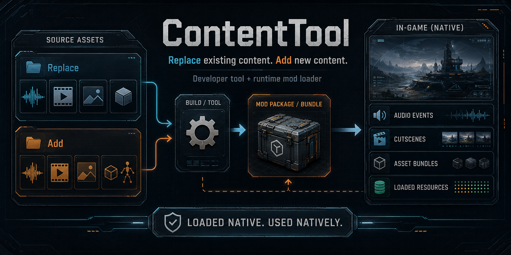

# ContentTool

> **Work in progress.** The manifest and commands may change before a stable release. Test the exact
> package you intend to publish.

ContentTool lets Phoenix Point mods replace or add game content. It is an engine for other mods and
does nothing by itself.

## Documentation

Open the [ContentTool documentation](https://ubermorgott.github.io/PhoenixPoint-Mod-ContentTool/).

If you are making a mod, start with the
[first green bake](https://ubermorgott.github.io/PhoenixPoint-Mod-ContentTool/getting-started/first-mod/).
Do not start by copying an old Resource Replacer folder. ContentTool imports texture sources only
from `Content\Textures\`.

## Install for players

1. Download `ContentTool-*.zip` from the [latest release](https://github.com/UberMorgott/PhoenixPoint-Mod-ContentTool/releases/latest).
2. Extract `ContentTool` into `<Phoenix Point>\Mods\`.
3. Start the game, open **Mods**, and tick **Content Tool**.

The result must contain `Mods\ContentTool\meta.json`, not
`Mods\ContentTool\ContentTool\meta.json`.

## License

[CC BY-NC 4.0](LICENSE) — Morgott. Content mods built with ContentTool remain their authors' work.
