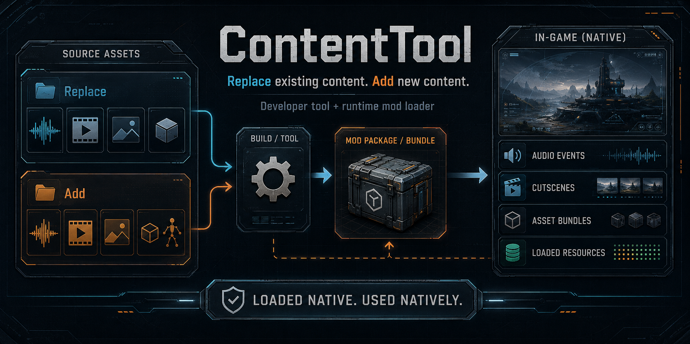

<p align="center"></p>

# ContentTool

[](LICENSE)
[](https://github.com/UberMorgott/PhoenixPoint-Mod-ContentTool/issues)

ContentTool is an engine mod for Phoenix Point. It lets other mods replace shipped content, add content, and build game objects from content and shipped definitions. It works in memory and never writes game files. Installed alone, it changes nothing.

**Work in progress:** manifests and commands may still change. Test the exact package you publish.

## What can mods do?

- Replace textures, meshes, material values, sounds, videos, and character bodies.
- Add models, sounds, and video keys.
- Build weapons, creatures, and playable humanoid soldiers from content and shipped definitions.

## Install for players

Install ContentTool when a mod depends on it. Mods that need it list `com.morgott.ContentTool` as a dependency, so the mod manager can enable it for you.

1. Download `ContentTool-*.zip` from the [latest release](https://github.com/UberMorgott/PhoenixPoint-Mod-ContentTool/releases/latest).
2. Extract the `ContentTool` folder into `<Phoenix Point>\Mods\`.
3. Check that the result is `Mods\ContentTool\meta.json`, **not** `Mods\ContentTool\ContentTool\meta.json`.
4. Start the game, open **Mods**, and tick **Content Tool**.

## Make a content mod

A content mod is a folder beside `ContentTool` under `Mods\`. It has `meta.json` and `ppcontent.json`; the manifest declares what to replace, add, or build. Source files go under `Content\`, in folders such as `Textures`, `Meshes`, `Models`, `Audio`, and `Videos`.

The author workflow is:

1. Check files.
2. Build.
3. Install.
4. Verify the install.
5. Package for sharing.

You can use the in-game bench or `ct_*` console commands:

- `ct_project <project>` bakes a project.
- `ct_sound bake <project>` bakes sound replacements.
- `ct_package <project>` stages the folder to share.

For a first texture replacement, follow the [10-minute quickstart](https://ubermorgott.github.io/PhoenixPoint-Mod-ContentTool/quickstart/). Do not start by copying an old Resource Replacer folder: textures are imported only from `Content\Textures\`.

## In-game bench

Once a campaign’s geoscape has loaded, open the bench with **Ctrl+Alt+B** or `ct_bench open`. It uses the squad bay. Its Home screen has these tasks:

- **Replace a model** — put your `.glb` on a soldier or creature part and check its bones.
- **Fit a weapon** — position a weapon your mod adds in a soldier’s hand, then save.
- **Build & share** — build, install and test your mod, then package it for sharing.
- **Add a weapon** — make a new weapon from a game weapon and your `.glb` model.
- **Sounds** — replace a game sound with your own `.wav`, `.ogg` or `.mp3`.
- **Videos** — replace a game cutscene with your own clip, or add a new one.

The right side shows what the task needs: your model live, a sound player, a video player, or build progress and a log.

## Documentation and examples

- [Documentation site](https://ubermorgott.github.io/PhoenixPoint-Mod-ContentTool/) (start here)
- [10-minute quickstart](https://ubermorgott.github.io/PhoenixPoint-Mod-ContentTool/quickstart/)
- [Recipes](https://ubermorgott.github.io/PhoenixPoint-Mod-ContentTool/recipes/)
- [Bench guide](https://ubermorgott.github.io/PhoenixPoint-Mod-ContentTool/bench/)
- [Console commands](https://ubermorgott.github.io/PhoenixPoint-Mod-ContentTool/reference/console-commands/)
- [Examples](https://ubermorgott.github.io/PhoenixPoint-Mod-ContentTool/examples/)

The repo’s `demos/` folder contains 11 projects: `MaterialTweak`, `WeaponMesh`, `WeaponAdd`, `ReplaceUiSounds`, `MenuMusic`, `AddUiSounds`, `IntroVideo`, `QuitCutscene`, `CustomCreature`, `HumanoidSoldier`, and `ReplaceCharacterBody`.

## Build from source

```text
dotnet build ContentTool.csproj -c Release
```

## License

[CC BY-NC 4.0](LICENSE). Copyright (c) 2026 Morgott. Content mods built with ContentTool remain their authors’ work.
