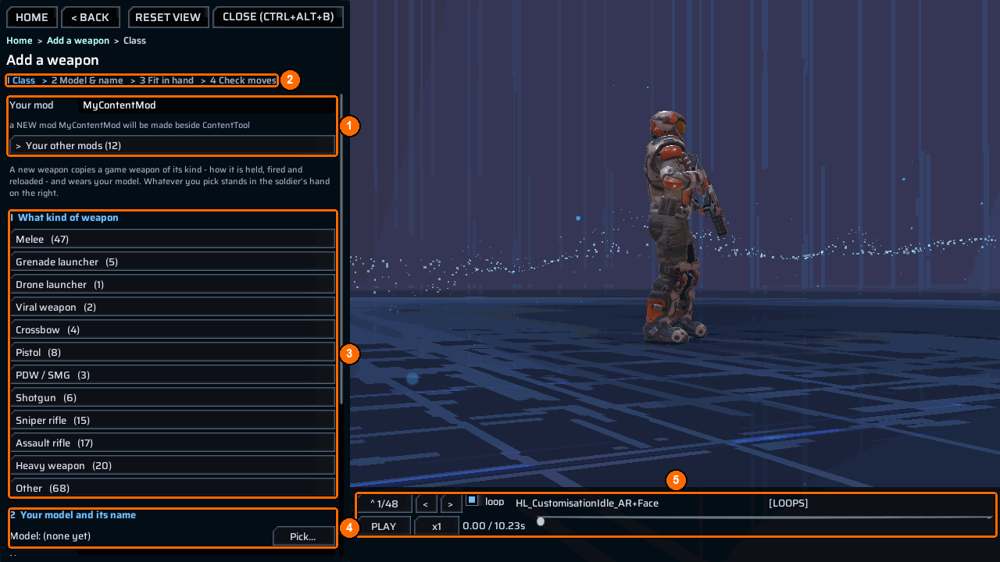
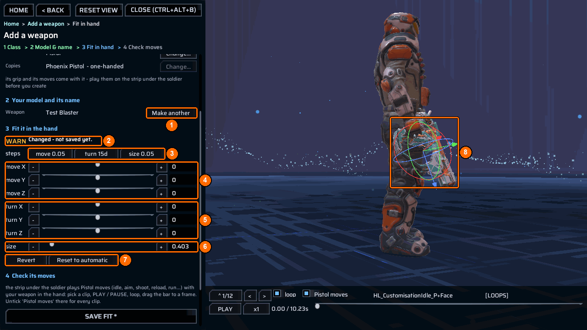
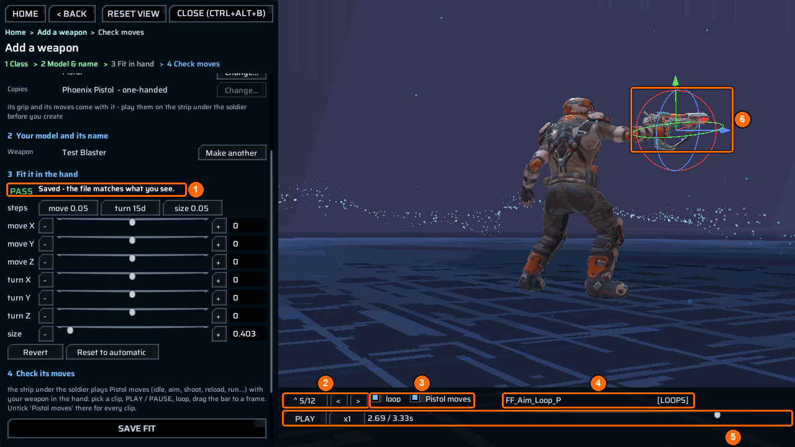

# Add a weapon

`Add a weapon` makes a new weapon from your `.glb` without writing JSON or code. The new weapon copies a shipped weapon of its kind (how it is held, fired and reloaded) and wears your model. Whatever you pick stands in the soldier’s hand on the right, so you see the result before you build.

The step bar reads `1 Class > 2 Model & name > 3 Fit in hand > 4 Check moves`. Until you pick a kind, an Assault soldier holding a Phoenix assault rifle stands on the platform, playing the game's idle.

## Example: make a "Test Blaster" pistol

This example uses a model file `nerf.glb`, the `Pistol` class, the weapon name `Test Blaster`, and a new mod named `CtWpnTest`.

### 1. Choose the kind of weapon

1. Open the [bench](index.md) and choose `Add a weapon`.
2. Type `CtWpnTest` in `Your mod` (**1**). The hint says `a NEW mod CtWpnTest will be made beside ContentTool`; the folder is created when you create the weapon. To add to a mod you already have, pick it under `Your other mods` (**1**).
3. The step bar (**2**) marks `1 Class`.
4. Under `1  What kind of weapon` (**3**), click `Pistol`. The list shows the kinds found in your game and how many shipped weapons each has. `Other` holds grenades, creature parts and vehicle guns.

Picking a kind also picks a shipped weapon to copy (for `Pistol`, the `Phoenix Pistol`) and puts a Phoenix soldier of that kind on the platform, holding it. Step 2 (**4**) waits for your model. Use the strip under the soldier (**5**) to play that weapon’s moves before you commit.

### 2. Add your model and name, then create

1. Check `Kind` and `Copies` (**1**). `Copies` reads `Phoenix Pistol  - one-handed`. Its grip and its moves come with it. Press `Change...` beside `Kind` to choose another kind, or beside `Copies` to search that kind’s other weapons.
2. Press `Pick...` beside `Model:` and choose `nerf.glb` in the file browser. The row now reads `Model: nerf.glb` (**2**).
3. Type `Test Blaster` in `Name` (**3**). The hint shows the definition name the weapon will get: `def name CtWpnTest_TestBlaster_WeaponDef` (the mod name and weapon name, letters and digits only). A name can be 1-40 characters.
4. Press `Create weapon` (**4**). The message says `created Test Blaster - next: Build & share`, and the weapon appears under `Weapons in CtWpnTest` (**5**), which read `none yet` before.

Until the game loads your weapon, the copied weapon stands in the hand (**6**). `Pistol moves` (**7**) limits the strip to this kind’s moves.

If `Create weapon` is grey, the line under it says what is missing: `pick what kind of weapon it is (step 1)`, `pick the game weapon it copies (step 1)`, `pick your .glb model (step 2)`, or `type the weapon's name (step 2)`.

!!! note "What `Create weapon` writes"
    - Your model, copied to `Content\Models\nerf.glb` in the mod folder.
    - A `publish` row that gives the model a new key (asset `models/nerf`).
    - A `weapons` row with the def name, `Test Blaster`, the weapon it copies, a new GUID, the model key, `"fit": "auto"`, `"count": "2"` and `"clips": "10"`. A new campaign starts with two Test Blasters and ten magazines in base storage.

    You need no DLL: when a content mod with `weapons` rows is enabled, ContentTool builds its weapons. See [Add new weapons](../recipes/weapon-add.md) for the rows themselves.

### 3. Build, enable and restart

The game loads a new weapon only when it starts, so this step leaves the bench once.

1. The main button now reads `Next: Build & share`. Press it. [Build & share](lifecycle-tab.md) opens with `CtWpnTest` selected. Press `Build & test` and wait for the steps to pass.
2. Enable `CtWpnTest` in the game’s `Mods` screen and restart the game.
3. Load a campaign, open the bench and choose `Add a weapon` again. Pick `CtWpnTest` under `Your other mods` (or in `Your mods` on the home screen). Under `Weapons in CtWpnTest`, `Test Blaster` is now marked `LOADED`. Click it.
4. Press `Put it in the hand`.

### 4. Fit it in the hand

1. Move the weapon with the `move X`, `move Y` and `move Z` rows (**4**), in metres (the slider covers -0.5 to 0.5). Turn it with `turn X`, `turn Y` and `turn Z` (**5**), in degrees (-180 to 180). Scale it with `size` (**6**), a multiplier from 0.05 to 5; the example needed `0.403`.
2. Each row has `-` and `+` buttons, a slider, and a box where you can type an exact number. The `steps` buttons (**3**) set how far one `-` or `+` press goes: click `move 0.05`, `turn 15d` or `size 0.05` to cycle through sizes.
3. You can also drag the arrows (move) and rings (turn) on the weapon itself (**8**).
4. The badge (**2**) says `Changed - not saved yet.` while your numbers are not in the file. `Revert` (**7**) goes back to the file; `Reset to automatic` (**7**) goes back to the measured fit. Neither touches the disk.
5. Scroll down and press `Save fit *`. It writes the fit into `CtWpnTest`’s `ppcontent.json`.

`Make another` (**1**) starts a new weapon in the same mod.

### 5. Check its moves

After saving, the badge says `Saved - the file matches what you see.` (**1**), and the step bar marks `4 Check moves`.

1. Use the clip counter and `<` / `>` (**2**) to choose a move; click the counter for the whole list.
2. Keep `Pistol moves` ticked (**3**) to list only this kind’s moves: idle, aim, shoot, reload, run and so on. Untick it to see every clip. `loop` (**3**) repeats the clip.
3. The clip’s name, here `FF_Aim_Loop_P`, and `[LOOPS]` or `[one-shot]` show on the strip (**4**).
4. Press `PLAY` / `PAUSE`, change the speed with `x1`, or drag the bar to a single frame (**5**).
5. Check that your weapon stays right in the hand (**6**) while the soldier aims, shoots, reloads and runs. If it does not, go back to step 4, adjust, and save again.

Start a **new** campaign to find the two Test Blasters in base storage.
