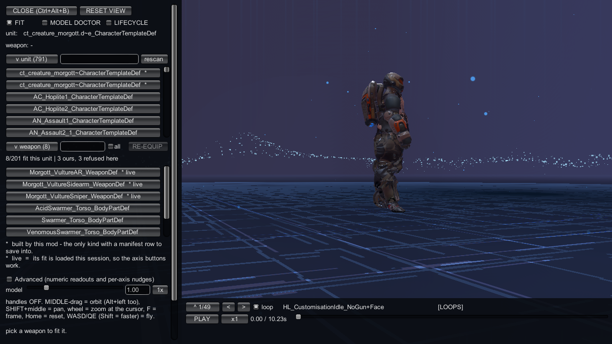

# The in-game bench

Use the bench to inspect a model on the squad-bay platform, check a replacement mesh,
or run a project's build stages without leaving the game.
It is a developer panel over the same producers as the console commands.

## Open the bench

Load or start a geoscape campaign first.
The bench needs the squad bay; the main menu is not enough.
Wait until the level has finished loading, then enter this in the developer console:

```text
ct_bench open
```

You can also press `Ctrl+Alt+B`.
With no argument, `ct_bench` toggles the panel.



## Pick a tab

` FIT` lets you compare weapons on a unit and adjust a content mod's weapon fit.
Shipped weapons are for comparison; they have no manifest row to save into.

` MODEL DOCTOR` checks a GLB against a prototype slot before you bake it.
Start with [Model Doctor](model-doctor.md) when you need to preserve your mesh's weights.

` LIFECYCLE` runs validation, baking, application, verification and packaging for a project.
Use the [Lifecycle tab](lifecycle-tab.md) once your sources and manifest are ready.

While a lifecycle job is busy, the ` FIT` and ` MODEL DOCTOR` toggles are disabled;
you can still switch to ` LIFECYCLE` so `Cancel` stays reachable.
The ` LIFECYCLE` toggle is disabled only while a Doctor ship is armed.

## Inspect the model

Middle-drag to orbit; `Alt+left` does the same.
Use `SHIFT+middle` to pan and the wheel to zoom at the cursor.
Press `F` to frame the model or `Home` to reset the view.

Use `WASD/QE` to fly the camera; hold `Shift` to move faster.
Open `Advanced (numeric readouts and per-axis nudges)` for numeric adjustments.
If nothing is framed, try `RESET VIEW`.

In the weapon list, `*` marks a weapon built by this mod.
`* live` means its fit is loaded in this session and the axis buttons work.
Use `SAVE TO FILE` to write a fit into its manifest.
`REVERT` restores the file's values; `RESET AUTO` restores the measured fit.
Neither undo writes to disk.

## Keep using the console

The bench does not replace the console workflow.
The existing [bake, test and package steps](../getting-started/lifecycle.md) still apply.

`Bake` uses the same producer as `ct_project <project>`.
`Apply` uses the same producer as `ct_route7 apply <project>`.
`Verify` uses the same producer as `ct_route7 verify <project>`.
`Package` uses the same packager as `ct_package <project>`, with a different output directory.

The dashboard writes each package under this path:

```text
%LOCALAPPDATA%\ContentTool\Packages\<projectId>\<yyyyMMdd-HHmmss>-<runId>
```

The console packager still writes under this path:

```text
<persistentDataPath>\ContentTool\Packaged\<project>
```

Keep using `ct_list` to discover targets and `ct_extract` to extract supported assets.
See [Find game content](../find-content/index.md) for their arguments.
The [PX Heavy armour example](../examples/replace-armour-set.md) shows why you need
both a clean mesh verdict and the correct shipped texture names.

## Close the bench

Press `CLOSE (Ctrl+Alt+B)`, use the hotkey, or enter `ct_bench close`.
The screen you came from remains underneath the panel.
Esc cancels a gizmo drag or an armed bone pick; it does not close the bench.

## When opening fails

| message | cause | fix |
|---|---|---|
| `ct_bench REFUSED: the level is not playing right now (it is loading, unloading or already gone). Nothing was touched. Try again once the geoscape is up.` | The level is not ready. | Wait for the geoscape to finish loading. |
| `ct_bench REFUSED: the workbench stands a unit in the SQUAD BAY, and the squad bay is part of a loaded geoscape campaign. Load or start a campaign first.` | No geoscape campaign is loaded. | Load or start a campaign, then open the bench. |
| `ct_bench: already open` | The panel is open. | Use its tabs, or close it. |
| `ct_bench: not open` | A close, reset or unit selection was requested without an open bench. | Enter `ct_bench open` first. |
