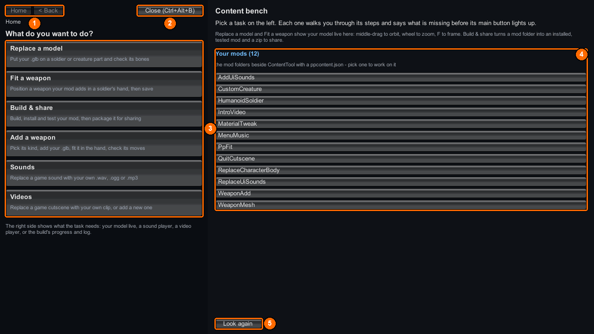

# The in-game bench

The bench walks you through making and testing a ContentTool mod inside the running game. The left side shows your task. The right side shows what that task needs: a live model, a sound or video player, or build progress and a log.

## Open the bench

1. Load or start a campaign. Wait for the geoscape to finish loading. The bench uses the squad bay, so it cannot open from the main menu.
2. Enter `ct_bench open` in the console, or press `Ctrl+Alt+B`.

`ct_bench` on its own toggles the bench. If opening is refused, check that a geoscape campaign has finished loading.

The bench looks like the game (its font, buttons and frames) and scales with the game window: at any resolution, in windowed, borderless or fullscreen mode, it keeps the same layout and grows or shrinks with the window height, also while you resize the window.

## Choose a task

Choose one of the six task cards (**3**):

| Card | What you can do |
|---|---|
| [`Replace a model`](model-doctor.md) | Put your `.glb` on a soldier or creature part and check its bones. |
| [`Fit a weapon`](fit-weapon.md) | Position a weapon your mod adds in a soldier’s hand, then save. |
| [`Build & share`](lifecycle-tab.md) | Build, install and test your mod, then package it for sharing. |
| [`Add a weapon`](add-weapon.md) | Pick its kind, add your `.glb`, fit it in the hand, and check its moves. |
| [`Sounds`](sounds.md) | Replace a game sound with your own `.wav`, `.ogg` or `.mp3`. |
| [`Videos`](videos.md) | Replace a game cutscene with your own clip, or add a new one. |

Every card opens a real screen with its own steps. Where a task also has a console route, its recipe describes both.

## Pick the mod you work on

`Your mods` (**4**) lists the folders beside ContentTool that contain a `ppcontent.json`. Clicking one makes it the mod that `Sounds`, `Videos` and `Add a weapon` write into. Press `Look again` (**5**) if you created a mod folder after opening the bench.

For example, click `MenuMusic` in `Your mods` (**4**), then open `Sounds` (**3**) to add a replacement sound to that mod.

## Move around and leave

`Home` and `< Back` (**1**) sit at the top of every screen. [Moving around and reading logs](navigation.md) explains them, the 3D camera and the log controls that every task shares.

To leave the bench, press `Close (Ctrl+Alt+B)` (**2**), press `Ctrl+Alt+B`, or enter `ct_bench close`.
