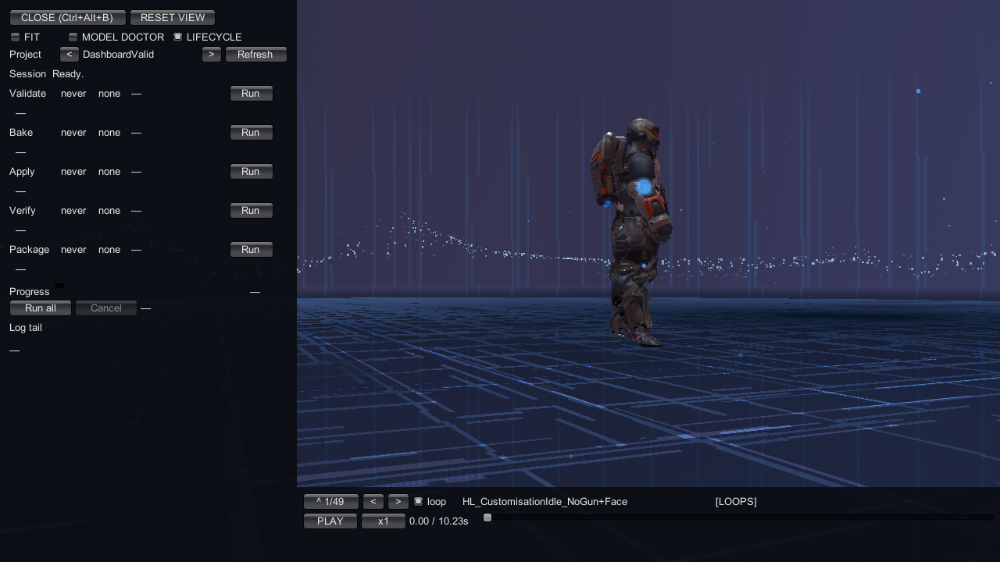
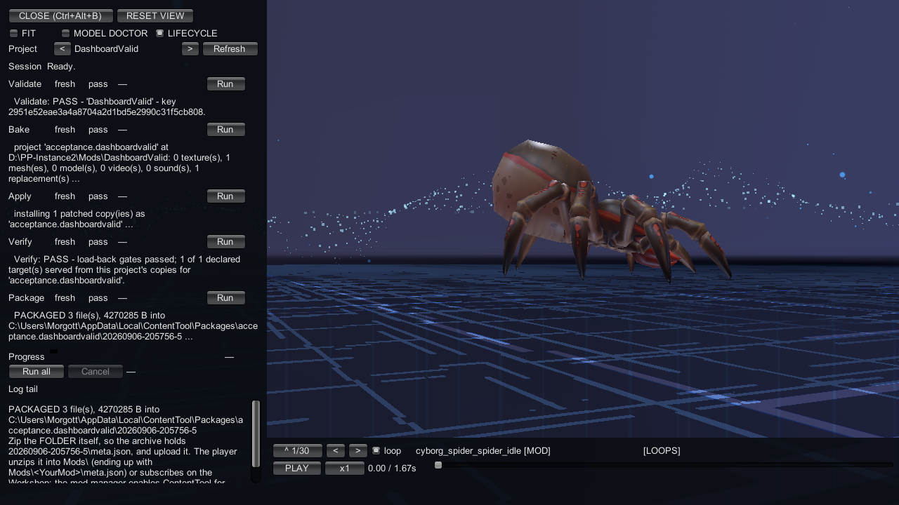
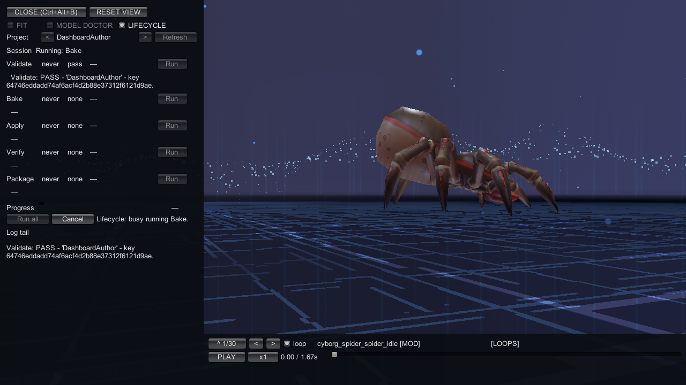
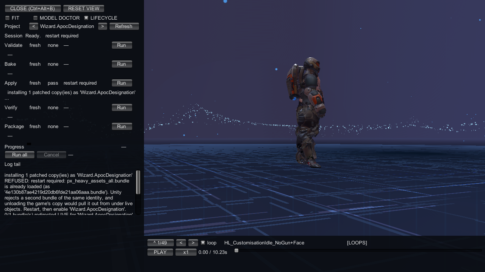
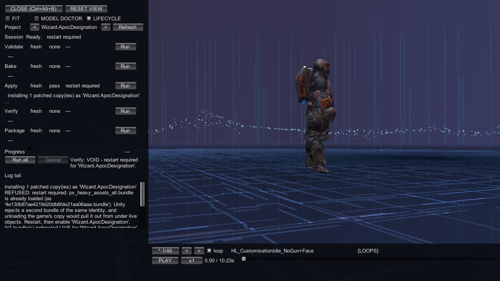
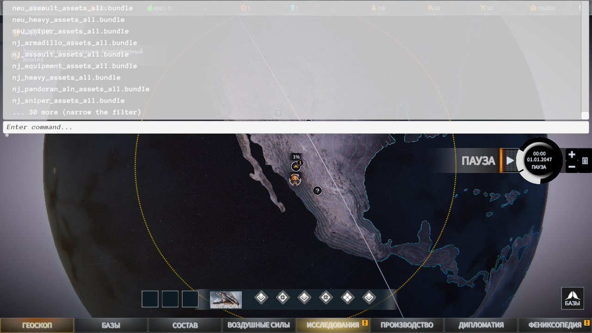

# Lifecycle tab: validate, bake, apply, verify, package

Open [the bench](index.md) from a loaded geoscape and select ` LIFECYCLE`.
Keep the panel open while running stages; baking, applying and verifying need it painted.
The tab uses the same producers as the console workflow.

## Select your project

Use `<` and `>` beside `Project` to select a project.
Press `Refresh` after adding a project or if the selected folder is unavailable.
`(none)` means no project is selected.

For a fresh build, leave the project disabled in the mod manager and restart before opening
the bench. An enabled project may already have baked and served its copies at startup.
The dashboard cannot rewrite a copy the game is serving.



## Read the rows

The rows run in this order: `Validate`, `Bake`, `Apply`, `Verify`, `Package`.
Each has a stage name, freshness, outcome, installation state and a `Run` button.
The verdict appears below the row; only its first line is shown, clipped after 160 characters.

Freshness is `never` before evidence exists, `stale` when it no longer describes the current
project, or `fresh` when it does. Outcome is `none`, `pass`, `fail` or `void`.
`pass` records a successful stage; `fail` records a failed check or producer.
`void` means the stage did not establish its result. Read its verdict before retrying.
An empty cell uses `—`.

The installation column carries Apply's own state, including `restart required`.
A `pass` there does not mean the game has replaced an already-loaded bundle.
`Progress` shows the current stage and counts. `Log tail` keeps the last 12 lines.

## Run the stages

Press `Run all` to run the sequence. It stops when a required preceding stage did not pass.
Use a row's `Run` to repeat one stage after fixing the cause of its verdict.
If prerequisite evidence is missing or stale, run the prerequisite named in the refusal first.

The row buttons and `Run all` are disabled while a job owns the run.
A session-blocked project also disables `Apply` and `Run all`.
Changing the source during a run invalidates its evidence; validate again.

### Validate

`Validate` loads and checks `ppcontent.json`, checks source placement and colliding stems,
and computes the project's cache key. It writes nothing.
It is an offline check; it does not need the painted-panel work used by later stages.
There is no separate equivalent console command listed for this stage.

```text
Validate: PASS - '<name>' - key <sha1>.
```

This is not a mesh-binding verdict. Use [Model Doctor](model-doctor.md) for that.
Put texture sources under `Content\Textures\` and mesh sources under `Content\Meshes\`.
Read any no-armature note before trying to replace a rigged target.

### Bake

`Bake` runs the same import and load-back producer as `ct_project <project>`.
Read its terminal result, not a successful row in the middle:

```text
ct_project: ALL PASS - <outPath>
ct_project: <n> FAILURE(S)
```

Either summary can carry ` - <n> warning(s), baked anyway`.
Fix failures before applying. Warnings still need inspection, especially material-part warnings.
A served copy cannot be rewritten; see the restart and refusal sections below.

### Apply

`Apply` uses the same producer as `ct_route7 apply <project>`.
It installs redirects to private patched copies without writing into the game installation.
These are the resident-bundle and live-redirect result shapes:

```text
applied - restart the game and enable '<name>' in the mod manager. Phoenix Point already loaded <bundle>.
applied and redirected LIVE - <bundle> now loads from the patched copy on the next load
```

The resident result can add ` This session keeps showing your Doctor preview.`
That preview is not proof of an installed replacement.

### Verify

`Verify` uses the same producer as `ct_route7 verify <project>`.
It checks load-back gates and how many declared targets are served from this project's copies.

```text
Verify: PASS - load-back gates passed; <n> of <m> declared target(s) served from this project's copies for '<name>'.
```

A shortfall is `void`; the named targets remain unproven.
If Apply has requested a restart, Verify refuses to run until a new game process starts.

### Package

`Package` uses the same packager as `ct_package <project>`, but chooses a new directory per run.
It does not replace Bake or Verify. Inspect and test the staged folder before distributing it.

```text
PACKAGED 32 file(s), 45485648 B into C:\Users\<you>\AppData\Local\ContentTool\Packages\Wizard.ApocDesignation\20260906-202735-5
```

The console command still writes to `<persistentDataPath>\ContentTool\Packaged\<project>`.
Follow the existing [package test](../getting-started/lifecycle.md#5-test-the-staged-folder).



## Cancel a run

Press `Cancel` while it is enabled, then wait for the current stage to stop.
Cancellation is a request. A waiting segment that has not started can be cancelled unrun.
A stage that already published successfully keeps its pass; cancellation does not undo it.
During publication, the panel says `Cancel unavailable during <stage>.`



The `Session` line uses these words:

```text
Ready.
Running: <stage>
Cancel requested; waiting for <stage> to stop.
Waiting for this panel to paint before <stage> continues.
Finishing: <stage>
```

It can append `restart required` or `session block: <projectId>`.
After cancellation, the verdict says `Lifecycle: <stage> cancelled; later stages were not run.`
or `Lifecycle: cancelled after <stage>; later stages were not run.`

## Clear a restart requirement

`restart required` means Apply found a bundle the game had already loaded.
The redirect cannot replace that loaded identity safely.
Restart with the project enabled so its copy is registered before the first bundle load.
The badge persists for the rest of the process; refreshing or rerunning Apply cannot clear it.



An already-enabled project may have served the correct copy at startup.
In that case, Verify before pressing Apply again: another Apply can set the restart barrier
even though the project's copy is already loaded.
See the [recorded armour run](../examples/replace-armour-set.md#read-the-final-stage-verdicts).



## When a stage is refused

Placeholders stand for the project, stage, path or prerequisite named in your result.
For the evidence-age refusal, `never`, `stale` and `fresh` are alternative printed values.

| message | cause | fix |
|---|---|---|
| `Lifecycle: unknown stage '<stage>'.` | An external caller supplied an unknown stage. | Use `Validate`, `Bake`, `Apply`, `Verify`, `Package` or `All`. |
| `Lifecycle: select a ContentMods project.` | Nothing is selected. | Select a project beside `Project`. |
| `Lifecycle: selected project is unavailable; refresh the project list.` | The selected project is unavailable. | Press `Refresh` and select an available project. |
| `Lifecycle: busy running <stage>.` | Another stage owns the job. | Wait, or request cancellation while available. |
| `Lifecycle: <stage> blocked; its main-thread work has to run behind an OPEN, painted panel. Open the bench (ct_bench open, from a loaded geoscape) and select the LIFECYCLE tab, then run it again.` | Bake, Apply, Verify or All lacks a painted panel. | Open the bench on a loaded geoscape and keep this tab selected. Validate is exempt. |
| `Lifecycle: Apply blocked while legacy disk patching is active.` | Legacy disk patching conflicts with Apply. | Stop that operation before retrying through the mod manager. |
| `Lifecycle: refused a write outside the mod-manager apply path or author output.` | The requested write is outside the allowed outputs. | Use the selected project's normal dashboard or mod-manager path. |
| `'<id>' failed to bake earlier in this session - not baking it again. Fix the lines it printed, then <retry hint>` | An earlier bake blocked the project for this session. | Fix the reported failures, restart the game and follow the printed retry hint. |
| `Verify: VOID - restart required for '<name>'.` | Apply set the restart barrier. | Restart with the project enabled, then verify. |
| `Lifecycle: <stage> blocked; <prerequisite> is never\|stale\|fresh.` | Required evidence is missing, outdated or has not passed. | Run the named prerequisite and read its verdict. |
| `Lifecycle: <stage> blocked in Run all; <prerequisite> did not pass.` | The sequence stopped at a prerequisite. | Fix that stage and rerun it before continuing. |
| `ct_project: '<dir>' is already being written by another run - nothing was baked. Wait for it to finish, then bake again.` | Another run owns the destination. | Wait for it to finish. |
| `ct_project: '<file>' is being served to the game right now, so it was not rewritten - restart the game and bake again.` | The game holds the patched copy open. | Disable the project and restart for a new bake; if you only need to test the served copy, run Verify before Apply. |
| `Lifecycle: project changed during <stage>; validate again.` | Inputs changed during the run. | Validate the new inputs before continuing. |
| `REFUSED: <outDir> already holds files. Name a folder that does not exist yet - a package is built from nothing, so no leftover of a previous run can be shipped by accident.` | The package destination is not empty. | Start a new package run with a new destination. |

## Read a long bake result

The row and `Log tail` are excerpts. In the in-game console, `ct_project`, `ct_route7` and
`ct_package` print a bounded verdict: at most 60 lines and 12 000 characters, with 400 characters
per line. The last 3 lines are always kept; `ct_project: ALL PASS` or `ct_project: <n> FAILURE(S)`
is the last verdict line. If anything was cut, one more line names the file holding the full text:
`<persistentDataPath>\ContentTool\Logs\console-<stamp>.txt`.
PPCLI's `connect console` still receives the full verdict.



For console arguments and failure meanings, keep using
[the console lifecycle](../getting-started/lifecycle.md) and [bake failures](../troubleshooting/bake-errors.md).
