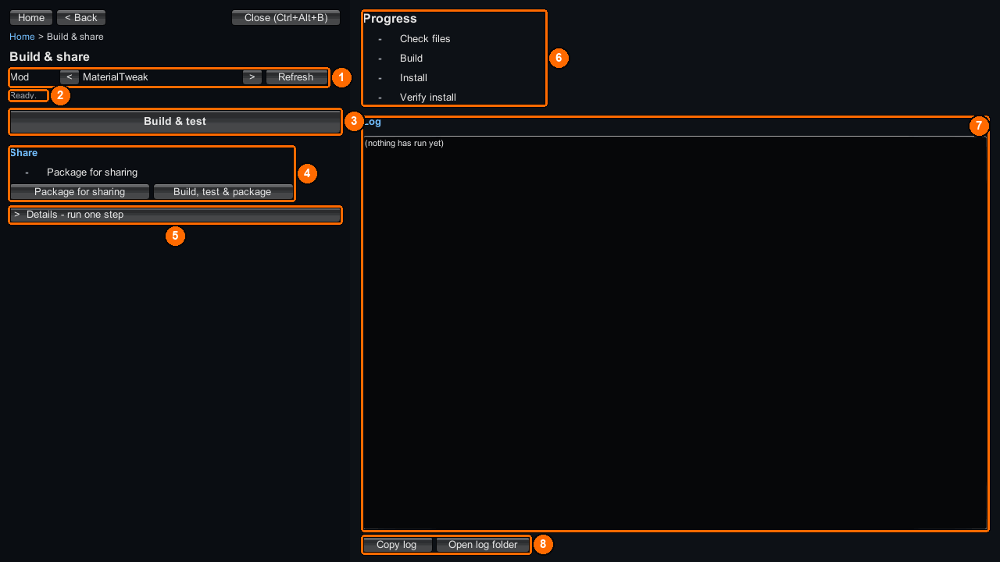
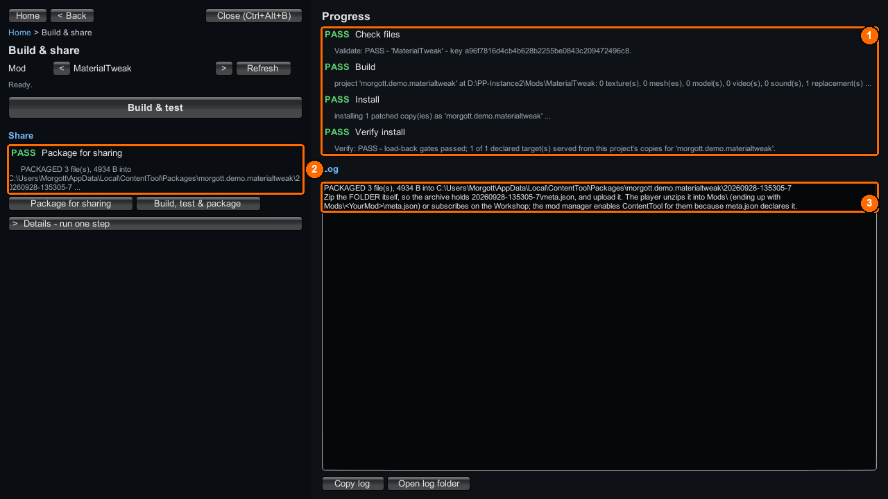

# Build & share

Use `Build & share` to turn a mod folder into an installed, tested mod and a package to share. It runs the same stages as the console commands, under plain names, and shows each result and the full log. See [the lifecycle](../concepts/lifecycle.md) for what each stage means.

Keep this screen open while a run is working: `Build`, `Install` and `Verify install` need it on screen.

## Pick a mod and build it



1. Open the [bench](index.md) and choose `Build & share`. `Replace a model` and `Add a weapon` bring you here with their mod already selected.
2. Use `<` and `>` beside `Mod` (**1**) to select your mod. Press `Refresh` (**1**) if you added a mod folder or changed the folders.
3. Read the status line (**2**). `Ready.` means you can start.
4. Press `Build & test` (**3**). It runs the four steps below in order and stops at the first one that fails or is refused. If it is grey, the line under it says why, for example `pick a mod above first`.
5. Watch `Progress` (**6**): each step gets its mark and the first line of its result. The `Log` (**7**) fills with the full output; it reads `(nothing has run yet)` before the first run. `Copy log` and `Open log folder` (**8**) work as on [every screen](navigation.md#read-and-share-the-log).

| Step | What it does | Console equivalent |
|---|---|---|
| `Check files` | Checks `ppcontent.json` and the source files it names. Writes nothing. | — |
| `Build` | Bakes the project. | `ct_project <mod>` |
| `Install` | Applies the patched copies. | `ct_route7 apply <mod>` |
| `Verify install` | Checks that the game loads the installed copies and serves the declared targets from them. | `ct_route7 verify <mod>` |

| Mark | Meaning |
|---|---|
| `PASS` | The step succeeded. |
| `FAIL` | The step failed; read its line and the log. |
| `VOID` | The step did not establish a result; its line says why. |
| `-` | Not run yet. |
| `*` after a mark | The mod’s project key changed since that step ran, so the result may be out of date. Run it again. |

While a run is going, `Cancel` asks it to stop. Steps already finished keep their results; later steps are skipped.

## Fix a failed build


In this example the `GlossTweak` mod names a material with a typo.

1. `Progress` shows `FAIL` at `Build` (**1**); `Install` and `Verify install` never ran.
2. Open `Details - run one step` (**2**). Every stage has a row (**3**) with its state, such as `Bake: stale, fail`, and its own `Run` button (**4**) that runs only that step.
3. Find the refusal in the log (**5**): `P3 REFUSED target 'ALN_Firewrom_DMG' is not a Material in aln_fireworm_assets_all.bundle`. The line also names the command that lists the real names: `ct_list assets aln_fireworm_assets_all.bundle Material`.
4. Correct the name in `ppcontent.json` (`ALN_Fireworm_DMG`), then press `Run` beside `Build` (**4**), or `Build & test` to run everything again.
5. If you need help, press `Copy log` (**6**); the bench confirms `Copied 1456 characters`. Paste it into your message.

## Restart cases

- The status says `restart required`: the game had already loaded the shipped bundle before the redirect. Restart the game with the mod enabled, then run `Verify install`.
- A copy the game is already serving cannot be rebuilt while it is loaded. Restart with the mod disabled, build, then enable it and restart again.

## Package for sharing



1. Check that all four steps show `PASS` (**1**).
2. Under `Share` (**2**), press `Package for sharing`. `Build, test & package` runs all five steps in one go instead.
3. The `Package for sharing` row turns `PASS` and shows where the package went (**2**), for example `PACKAGED 3 file(s), 4934 B into ...\ContentTool\Packages\morgott.demo.materialtweak\20260928-164013-7`.
4. Read the end of the log (**3**): zip the **folder itself**, so the archive holds `20260928-164013-7\meta.json`, and upload it. A player unzips it into `Mods\` or subscribes on the Workshop; the mod manager enables ContentTool for them because `meta.json` declares it.

Every bench package gets its own new folder:

```text
%LOCALAPPDATA%\ContentTool\Packages\<projectId>\<yyyyMMdd-HHmmss>-<runId>
```

The console packager, `ct_package <mod>`, writes under `<persistentDataPath>\ContentTool\Packaged\<mod>` instead. Whichever you use, install and test the exact package you intend to share. `Check files` and packaging do not need this screen on view; the other steps do.
