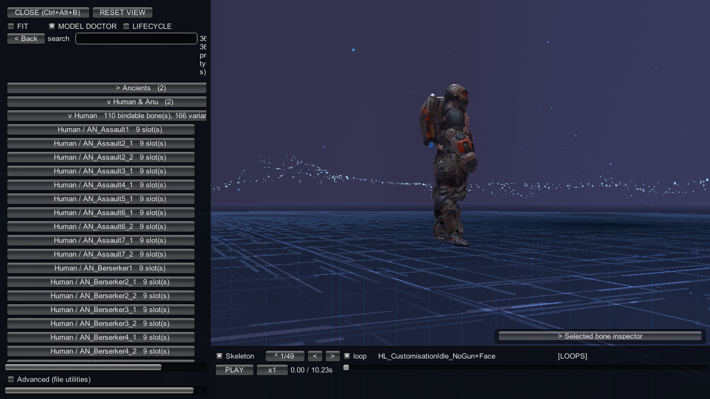
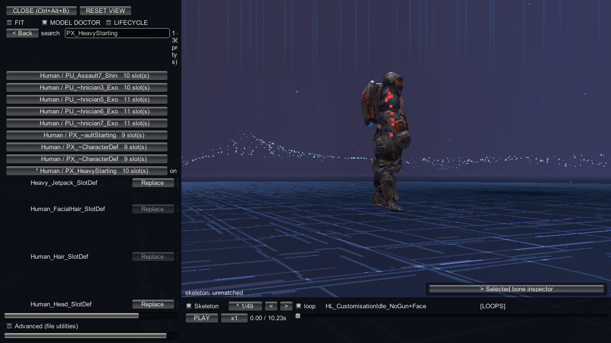
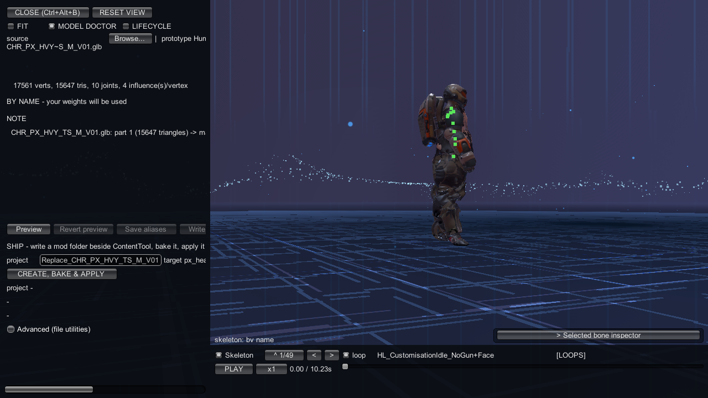
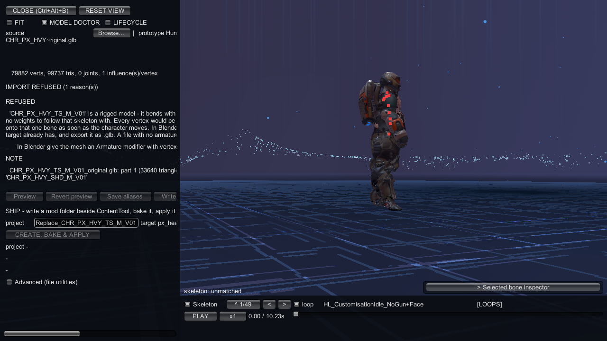
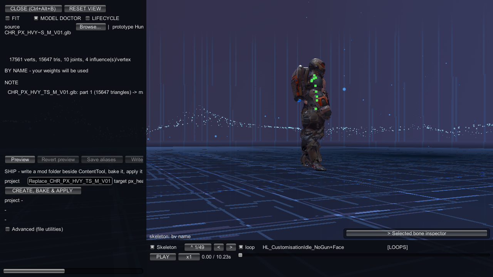

# Model Doctor: check a mesh before you bake

Open [the bench](index.md) from a loaded geoscape and select ` MODEL DOCTOR`.
Check the file against the slot you intend to replace before creating a project.
A green binding verdict says how the mesh will bind; read the rows for material problems too.

## Pick a prototype and variant

Press `Change` to open the prototype browser.
Use `search`, expand a category, then choose the prototype and its variant.
The standing variant is marked `*`; wait for `on the platform` after `rebuilding...`.

Prototype names come from the manager def without `_AddonsManagerDef`.
When a manager has several representatives, the variant adds the representative name
without `_CharacterTemplateDef`: `Human / PX_HeavyStarting`, for example.
The prototype name in the header remains `Human`.



## Pick the slot and source

Find the slot on that variant and press its `Replace` button.
The chosen button reads `[Replace]`; slots also offer `Extend` where available.
A slot without a renderer cannot supply a replacement target.
Use the slot's refusal to choose another target.



Press `Browse...` and choose your GLB.
The header shows the source, prototype, mode, variant and slot def name.
The next row counts vertices, triangles, joints and influences per vertex.
Wait for `reading...` or `queued...` to finish before reading the verdict.

## Read the header

The four possible header sentences are:

```text
BY NAME - your weights will be used
NEAREST-BONE - the bake would import this but NOT use your weights (N reason(s), M warning(s))
NOT RIGGED - the target carries no bind poses
IMPORT REFUSED (N reason(s), M warning(s))
```

`BY NAME` means your weights bind to the target's bones by name.
It gains ` (N warning(s) below)` when the report contains warnings.
`NEAREST-BONE` means every vertex will be welded whole to its nearest bone;
the bake imports the mesh but discards your weights.
`NOT RIGGED` describes a target with no bind poses.
`IMPORT REFUSED` means nothing will be written.



## Read every row

`REFUSED` rows block writing and previewing.
`LOSES YOUR WEIGHTS` rows explain a downgrade to nearest-bone binding.
`WARNING` rows flag a non-blocking issue; the bake can continue.
`NOTE` rows report information, such as which material will paint each part.

Rows under `-- the game's model, not your file --` describe the target.
Rows prefixed `[aliases]` describe the bone-name sidecar.
Use `Copy report` to copy the file, target, hash, verdict and each row's remedy.

Check `SubmeshMaterials` warnings even when the header says `BY NAME`.
The game paints part N with material N. A leading one-triangle shard can take the
body material and push the real body onto the shoulder-pad material.
This is a heuristic warning: it does not fail the run or block application.
Inspect the parts in Blender, use `Mesh > Merge > By Distance`, assign faces to one
material slot, or order the parts to match the target; then re-export and check again.

A mesh without an armature cannot replace a rigged target.
Give it an Armature modifier, vertex groups and weights for the target's existing bones.
The project validator reports this note; it does not prove the chosen target is unrigged:

```text
'<file>.glb' carries no armature, so a rigged target would refuse it and an unrigged one takes it as-is.
```



Use `Preview` to inspect an accepted mesh on the live target.
`Preview - no live bones to bind onto` means a bound preview is unavailable.
Use `Revert preview` to remove the preview before comparing again.

## Ship the replacement

The section reads `SHIP - write a mod folder beside ContentTool, bake it, apply it`.
It shows the `project` name box and `target <bundle> / <asset>`.
Check that pair before pressing `CREATE, BAKE & APPLY`.

The default name is `Replace_` plus the shipped asset name, with unsupported characters
replaced by `_`, limited to 64 characters and stripped of trailing dots and spaces.
Keep the default or choose another valid project name.
Result rows show `project <path>`, the result and its tail; `-` means no result yet.



The project is a sibling of ContentTool, never a folder inside it:

```text
Mods\
  ContentTool\
  <name>\
    meta.json
    ppcontent.json
    Content\
      Meshes\
        <stem>.glb
        <stem>.glb.aliases.json
```

On the first press, the manifest starts with this template:

```json
{"id": "<name>", "bundle": "<name>.bundle"}
```

The generated mod metadata uses this template. Angle brackets stand for generated values;
the dependency is supplied by ContentTool, not something to type into the box.

```json
{
  "ID": "<id>",
  "Version": "1.0.0",
  "Name": [ { "Key": "English", "Value": "<id>" } ],
  "Dependencies": [ "<Package.EngineId>" ]
}
```

The press copies the GLB bytes and its alias sidecar, then adds one `replace` row
with `bundle`, `asset` and `mesh` to the manifest. An existing project keeps its other rows.
The `mesh` value is the copied file's stem.
It then bakes and applies through the same producers as `ct_project <project>`
and `ct_route7 apply <project>`.

A completed install switches to the [Lifecycle tab](lifecycle-tab.md).
If application needs a restart, follow that tab's restart instructions.
A preview alone does not prove the baked copy is served.

## When the button is disabled

| message | cause | fix |
|---|---|---|
| `the Doctor is still working` | The report is unfinished. | Wait for the verdict. |
| `no .glb is loaded` | No source was chosen. | Press `Browse...` and choose a GLB. |
| `the report is not green by name` | The report does not accept your weights by name. | Fix the diagnostic rows and pick the file again. |
| `no replaceable slot is picked` | No replacement target is selected. | Press `Replace` on the intended slot. |
| `no shipped target derived for this slot` | The slot supplies no shipped asset pair. | Pick a slot with a derived target. |
| `the slot has no renderer` | There is no mesh renderer to replace. | Pick a rendered slot. |
| `project name REFUSED: '<name>' - use 1-64 characters starting with a letter or digit, then letters, digits, '.', '_' or '-'; no path separators, no device names` | The project name is invalid. | Use a name within the printed rules. |

## When a ship stops

Read the result before pressing again. Some refusals leave a complete project on disk.
Keep that folder and fix the named input; do not assume every refusal undoes the press.

| message | cause | fix |
|---|---|---|
| `'<root>' already exists, is not empty, and holds no ppcontent.json, so it is not a ContentTool project - pick another project name` | The destination is another kind of folder. | Choose another project name. |
| `'<source>' changed on disk after its green verdict, so nothing was written - pick it again, read the report, then press Ship again` | The checked bytes are stale. | Pick the file again and read its new report. |
| `Content\Meshes\<stem>.glb already holds DIFFERENT bytes (sha <a> vs <b>), so it was NOT overwritten - rename the file you are shipping, or ship into another project` | A different source already owns that name. | Rename your source or choose another project. |
| `<stem>.glb.aliases.json already sits beside the copy but this Doctor session has no bone map, so the bake would silently use mappings you never saw - delete it, or set the map` | An unseen sidecar would affect the bake. | Set the intended map or remove the obsolete sidecar. |
| `'<metaPath>' already exists but is not a mod this project can ship: <why> - fix that file, or ship into another project` | Existing metadata is incompatible. | Fix the named file or choose another project; if the result says the mesh and row already exist, keep them and retry. |
| `Content\Meshes\<twin> is already there and a replacement names only the stem '<stem>', so shipping <file> beside it would make the bake SKIP BOTH - delete <twin>, or rename the file you are shipping` | Two supported files share a stem. | Keep one source per stem, or rename the incoming file. |
| `'<stem>.glb' would be the copy under Content\Meshes\, and Windows reserves '<bare>' with or without an extension, so that file cannot be created - rename the file, then press Ship again` | Windows reserves the source name. | Rename the source. |
| `the bone map sends two of the file's bones onto one of the game's, or leaves a name empty, so nothing was written - the bake would refuse the sidecar this press produced; fix the map, then press Ship again` | The alias map is invalid. | Give each mapped bone a non-empty, distinct target. |
| `<stem>.glb.aliases.json already sits beside the copy with a DIFFERENT bone map: it belongs to <targets>, and this press ships the same file for "<asset>" in "<bundle>" - one .glb carries ONE alias map, so nothing was written; ship this .glb under another file name for that target` | One copied GLB would need two maps. | Give this target its own source filename. |
| `the slot or the file changed before the bake started, so nothing was written - press Ship again` | The selection changed during the press. | Confirm the current selection and retry. |
| `the COPIED glb did not re-read green (<Outcome>), so nothing was baked - the project on disk is complete, fix the file and press Ship again` | The copied file failed its second check. | Fix the file in the complete project and retry. |
| `the slot's renderer changed while Ship was running, so nothing was baked - pick the slot again` | The live target changed. | Pick the slot again. |
| `NOT APPLIED: <bundle> was neither redirected nor already loaded - the log above names the refusal; the project folder is complete and can be enabled after a restart` | Application did not install the copy. | Read the preceding refusal, fix its cause and enable the project after restarting. |
