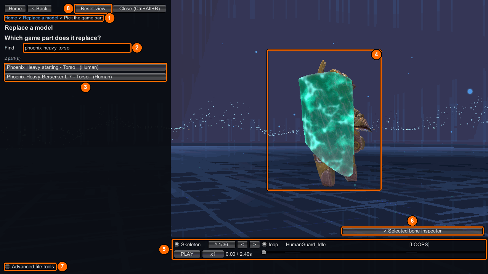
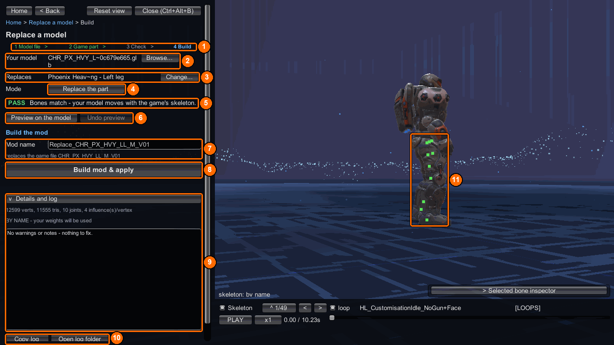
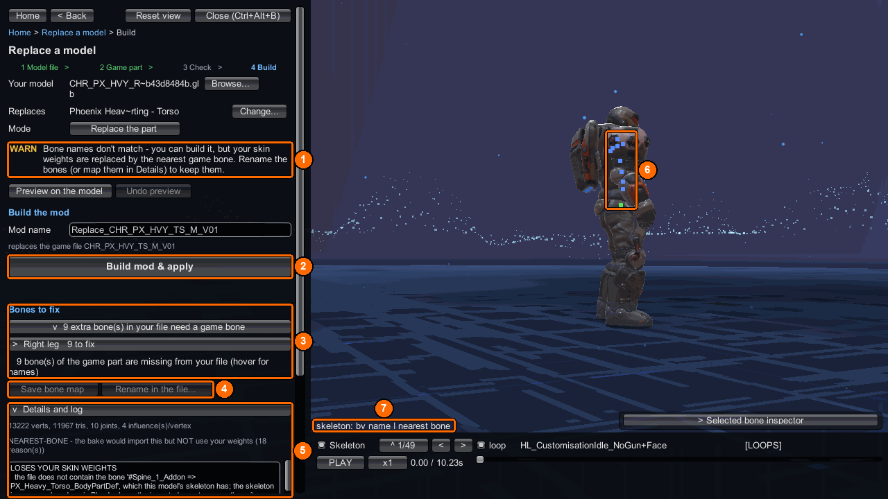
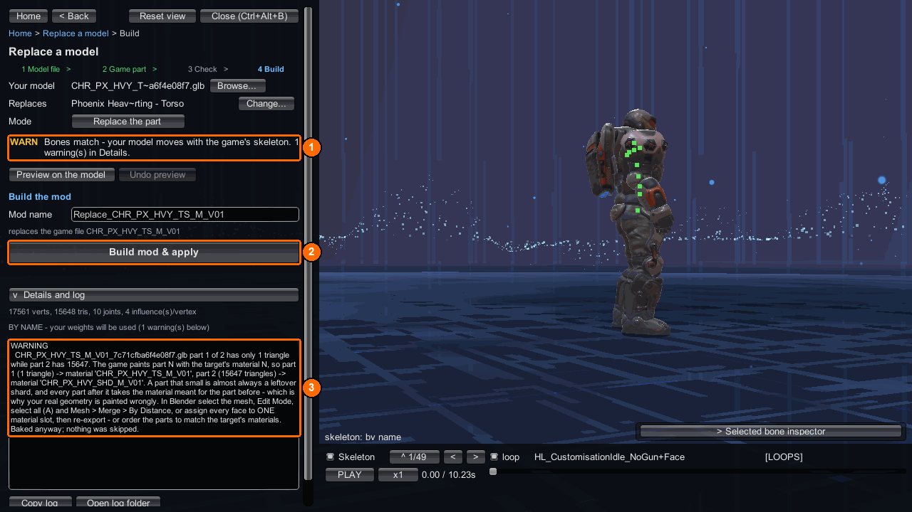
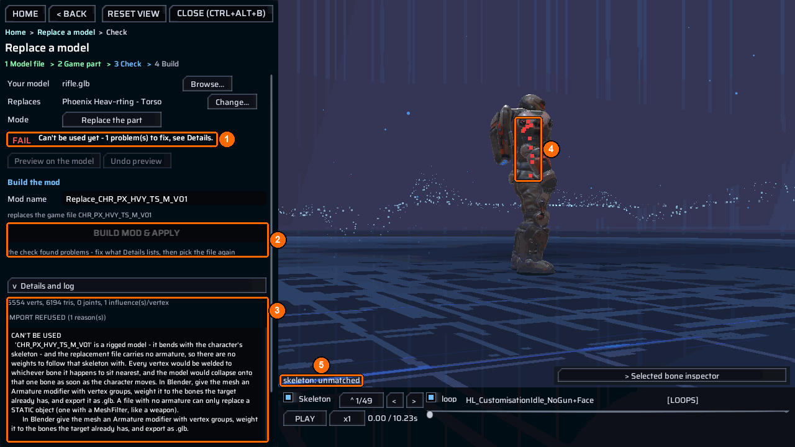

# Replace a model

Use `Replace a model` (also called the Model Doctor) to put your `.glb` on a shipped soldier or creature part. The bench checks your model against that part’s bones before you build, shows it on the live model, and then builds and installs the mod for you.

The step bar reads `1 Model file`, `2 Game part`, `3 Check`, `4 Build`.

## Example: replace the Phoenix Heavy torso

### 1. Pick your file and the game part

1. Open the [bench](index.md) and choose `Replace a model`.
2. Press `Choose your model file (.glb)...` and pick your torso `.glb` in the file browser.
3. Press `Choose the game part it replaces...`. The picker asks `Which game part does it replace?`.

4. Type `phoenix heavy torso` into `Find` (**2**). The breadcrumb (**1**) shows you are in `Pick the game part`.
5. Click `Phoenix Heavy starting - Torso (Human)` in the matches (**3**). To look through everything instead, open `Browse all <n> game models`.

While you pick, the 3D view (**4**) shows the model currently loaded, and the strip under it (**5**) plays its animations. `> Selected bone inspector` (**6**) shows details of a bone you select. `Advanced file tools` (**7**) holds extra tools to shrink a `.glb`, pack it, or check its skeleton (`SLIM` / `ZIP` / `SKEL`). `Reset view` (**8**) puts the camera back.

### 2. Read the check

The check starts on its own as soon as both are picked. Wait while the panel says `checking the model...`.

- The step bar (**1**) now marks `4 Build`.
- `Your model` (**2**) shows your file; `Browse...` picks another. `Replaces` (**3**) shows the game part; `Change...` picks another.
- The badge (**5**) gives the verdict in one sentence. Here: `PASS` `Bones match - your model moves with the game's skeleton.`
- `Details and log` (**9**) shows the counts (vertices, triangles, joints, influences per vertex), the binding, here `BY NAME - your weights will be used`, and every warning or note. Here it says `No warnings or notes - nothing to fix.` `Copy log` and `Open log folder` sit under it; scroll the panel down to reach them.
- On the model, bone markers (**10**) show how your bones bind. The line in the corner of the view says `skeleton: by name`.

| Badge | Meaning | What to do |
|---|---|---|
| `PASS` | Bones match by name. Your model moves with the game skeleton and keeps its skin weights. | Preview it and build. |
| `WARN` | The model builds, but the check found something you should look at. | Read the sentence and `Details and log`, then decide. |
| `FAIL` | The model cannot be used for this part yet. `Build mod & apply` stays grey. | Fix what `Details and log` lists, then pick the file again. |

| Marker colour | Meaning |
|---|---|
| Green | The bone matched a game bone by name. |
| Yellow | The bone matched through your bone map. |
| Blue | The bone falls back to the nearest game bone. |
| Red | The bone is not matched. |
| Dim grey | An attachment point the game itself skips. |

### 3. Preview and build

1. Keep `Mode` (**4**) on `Replace the part`. Pressing it switches to `Add to the part`, a different operation; `Build mod & apply` needs `Replace the part`.
2. Press `Preview on the model` (**6**) to see your mesh on the live soldier. `Undo preview` (**6**) puts the original back. A preview writes no files.
3. Check `Mod name` (**7**). It starts as `Replace_` plus the game file name, and the hint under it says `replaces the game file <name>`.
4. Press `Build mod & apply` (**8**). The bench creates or updates a mod folder beside ContentTool, copies your `.glb` into it, writes the replacement row (and a saved bone map, if you made one), then builds and installs the mod.

When the build succeeds, the bench opens [Build & share](lifecycle-tab.md) with that mod selected, so you can test and package it. If the result asks for a restart, restart the game with the mod enabled before you judge the replacement. A preview alone does not prove that the built replacement is installed.

If `Build mod & apply` is grey, the line under it says why: `wait - the check is still running`, `pick your .glb model file first`, `wait - the check has not run yet`, or `the check found problems - fix what Details lists, then pick the file again`.

## When the check is not a clean PASS

### Bone names do not match (WARN)

This file was made for the right leg and put on the torso. The badge (**1**) says `Bone names don't match - you can build it, but your skin weights are replaced by the nearest game bone. Rename the bones (or map them in Details) to keep them.`

- `Build mod & apply` (**2**) is still available: a `WARN` builds, only a `FAIL` blocks. But the result moves with the nearest game bones, not with your own weights.
- `Bones to fix` (**3**) counts the problem by body region. `9 extra bone(s) in your file need a game bone` opens the list; a row such as `Right leg   9 to fix` groups them; the line below counts the game bones your file lacks (hover for names).
- Map each extra bone to the game bone it should follow. When the mapping is valid, `Save bone map` (**4**) saves it beside your `.glb`, and `Rename in the file...` (**4**) writes a plan that renames the bones in the file. Both stay grey until then.
- `Details and log` (**5**) says `NEAREST-BONE - the bake would import this but NOT use your weights` and lists each `LOSES YOUR SKIN WEIGHTS` row.
- Blue markers (**6**) and `skeleton: by name | nearest bone` (**7**) show the fallback on the model.

The best fix is in Blender: rename the bones to the game part’s bone names and export again. Then pick the file again and check for `PASS`.

### Material parts in the wrong order (WARN)

Here the bones match, but the badge (**1**) ends with `1 warning(s) in Details.` `Build mod & apply` (**2**) stays enabled. Read `WARNING` rows even when the bones match: the one in `Details and log` (**3**) says part 1 of 2 has only 1 triangle. The game paints part N with the part’s material N, so a tiny leftover part shifts every later part onto the wrong material.

In Blender, select the mesh, enter Edit Mode, select all (`A`), then use Mesh > Merge > By Distance; or assign every face to one material slot. Export again and pick the file again. The report says `Baked anyway; nothing was skipped.` if you build as it is.

### The model has no armature (FAIL)

A rifle `.glb` with no armature was put on the rigged torso. The badge (**1**) says `Can't be used yet - 1 problem(s) to fix, see Details.` `Build mod & apply` is grey (**2**) with the reason `the check found problems - fix what Details lists, then pick the file again`.

`Details and log` (**3**) says `IMPORT REFUSED (1 reason(s))` and explains under `CAN'T BE USED`: a rigged part bends with the character’s skeleton, and a file without an armature has no weights to follow it. Red markers (**4**) and `skeleton: unmatched` (**5**) show that nothing binds.

The fix, as the report says: in Blender, give the mesh an Armature modifier with vertex groups, weight it to the bones the target already has, and export it as `.glb`. A file with no armature can only replace a static object, such as a weapon.

## See also

- [Replace a mesh](../recipes/meshes.md) for the console route and OBJ files.
- [Build & share](lifecycle-tab.md) to test and package the mod the bench built.
