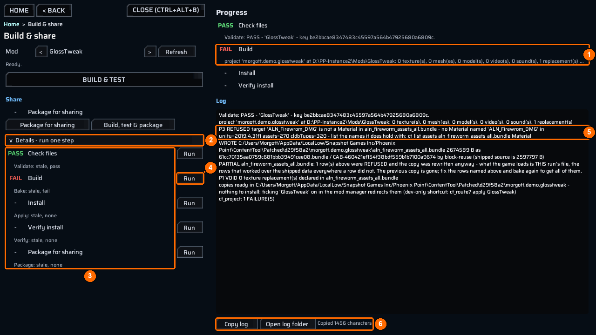

# Moving around and reading logs

Every bench task uses the same navigation and log controls. Learn them once here.

## Go back without losing your picks

- Press `Home` to return to the task cards. Your picks remain.
- Press `< Back` to close an open picker or file browser. With nothing open, it returns to Home. `Esc` does the same as `< Back`; while you are typing in a field, the first `Esc` only leaves the field.
- The breadcrumb under the buttons, here `Home > Replace a model > Pick the game part` (**1**), shows where you are. Click any part except the last (the blue ones) to return there.

A task’s step bar, such as `1 Model file > 2 Game part > 3 Check > 4 Build`, shows completed steps in green and the current step in blue. Click a completed step to go back to it. Its tooltip says `go back to this step - nothing you picked is lost`.

For example, after choosing a model and a game part, click the completed `1 Model file` step to pick another file. Your game part stays picked.

## The main button and its reason line

Each task has one wide main button, such as `Build mod & apply` or `Add to mod & build`. When it is grey, read the line directly beneath it: it names the one thing the button still needs, for example `pick the game sound it replaces (step 2)`.

## Use the 3D view

`Replace a model`, `Fit a weapon` and `Add a weapon` show a live 3D view (**4**). Only these screens have `Reset view` (**8**); it returns the camera to its start, and the `Home` key does the same.

| Action | Control |
|---|---|
| Orbit | Middle-drag, or `Alt` + left-drag |
| Pan | `Shift` + middle-drag |
| Zoom toward the pointer | Mouse wheel |
| Frame the model | `F` |
| Reset the camera | `Home` |
| Fly | `W` `A` `S` `D` and `Q` / `E`; hold `Shift` to move faster |

The strip under the view (**5**) plays the model’s animations: `Skeleton` shows bone markers, the counter (`^ 1/36`) opens the clip list, `<` and `>` step through clips, `loop` repeats, `PLAY` / `PAUSE` and the speed button (`x1`) control playback, and the bar scrubs to a frame. `[LOOPS]` or `[one-shot]` says whether the clip itself loops.

## Choose the mod a screen writes into

`Sounds`, `Videos` and `Add a weapon` start with a `Your mod` field. The line under it tells you what will happen:

| Line | Meaning |
|---|---|
| `adds to your mod <Name>` | The folder exists; the screen adds to it. |
| `a NEW mod <Name> will be made beside ContentTool` | The folder is created, with `ppcontent.json` and `meta.json`, on the first press that writes. |
| `type a mod name: letters, digits, '.', '_' or '-'` | The name cannot be used. |

Open `Your other mods (<n>)` to pick an existing mod, and press `Look again` to rescan the folders.

## Read and share the log

`Replace a model`, `Sounds`, `Videos` and `Add a weapon` keep their log in a `Details and log` fold. `Build & share` shows its `Log` on the right. The log text is selectable.

- `Copy log` (**6**) puts the whole log on the clipboard, not only the visible part. The bench confirms it with a line such as `Copied 1363 characters` (**6**).
- `Open log folder` (**6**) opens the folder of the game’s own log file (`Player.log`) in Explorer, with the file selected.

When you ask someone for help, say which task, file and game target you chose, paste the copied log, and quote the line under any grey button. In the picture, the refusal line in the log (**5**) explains the failure; the `FAIL*` mark alone (**1**) does not.
