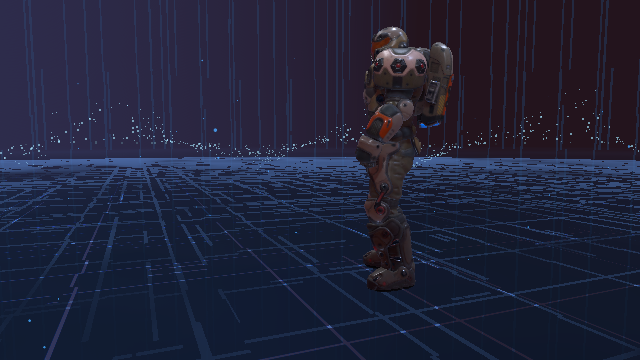
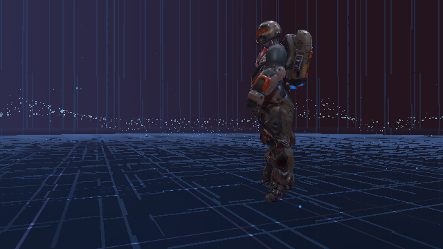
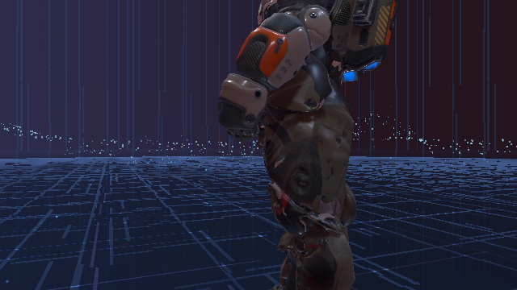
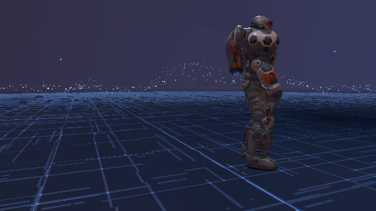
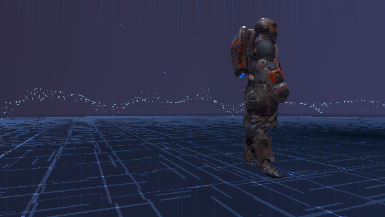

# Worked example: a PX Heavy armour set from a Blender export

`Wizard.ApocDesignation` replaces a PX Heavy torso and both legs with three GLBs and one albedo.
In run 5 on 2026-09-06, the activated project's startup bake completed `5 replacement(s)`
with `ct_project: ALL PASS` and no failures or warnings, while the later dashboard `Bake`
was `void` because the copy was already being served to the game. Earlier runs show what to check first.

## Compare the shipped model

Open [Model Doctor](../bench/model-doctor.md) and choose `Human / PX_HeavyStarting`.
Use the same variant when comparing your source with the shipped armour.
This is the front view before replacement:



## Put the sources where the bake reads them

The three replacement targets and the two texture targets live in `px_heavy_assets_all.bundle`.
The working inputs are:

```text
Wizard.ApocDesignation\
  meta.json
  ppcontent.json
  Content\
    Meshes\
      CHR_PX_HVY_TS_M_V01.glb
      CHR_PX_HVY_RL_M_V01.glb
      CHR_PX_HVY_LL_M_V01.glb
      materials\
        RR_soldier_albedo.png
    Textures\
      RR_soldier_albedo.png
```

Keep the copy under `Content\Meshes\materials\` if your material sidecars reference it.
Copy the albedo into `Content\Textures\` for the texture replacement rows.
Moving the only copy would break this project's 16 material sidecars.

Use the final five-row `ppcontent.json`:

```json
{
  "id": "Wizard.ApocDesignation",
  "bundle": "ApocDesignation.bundle",
  "replace": [
    {
      "bundle": "px_heavy_assets_all.bundle",
      "asset": "CHR_PX_HVY_TS_M_V01",
      "mesh": "CHR_PX_HVY_TS_M_V01"
    },
    {
      "bundle": "px_heavy_assets_all.bundle",
      "asset": "CHR_PX_HVY_RL_M_V01",
      "mesh": "CHR_PX_HVY_RL_M_V01"
    },
    {
      "bundle": "px_heavy_assets_all.bundle",
      "asset": "CHR_PX_HVY_LL_M_V01",
      "mesh": "CHR_PX_HVY_LL_M_V01"
    },
    {
      "bundle": "px_heavy_assets_all.bundle",
      "asset": "CHR_PX_HVY_TS_M_V01_Albedo",
      "texture": "RR_soldier_albedo"
    },
    {
      "bundle": "px_heavy_assets_all.bundle",
      "asset": "CHR_PX_HVY_Legs_M_V01_albedo",
      "texture": "RR_soldier_albedo"
    }
  ]
}
```

`asset` names the shipped target; `mesh` and `texture` name your source stems.
Two texture rows can share one source. The targets, not the source files, must be distinct.
Keep the lowercase `albedo` in `CHR_PX_HVY_Legs_M_V01_albedo`.

## Diagnose the first export

Runs 1 and 2 used different exports from the raw GLBs on disk.
The torso had no armature. Both legs had added bones absent from the target skeleton.
The albedo existed, but only under `Content\Meshes\materials\`.

The early validator passed that project. These are the recorded Validate and Bake results:

```text
Validate: PASS - 'Wizard.ApocDesignation' - key c13f495e430889997a905a38927911519bcc815f.
P1 REFUSED 'RR_soldier_albedo' is not a .png/.jpg under Content\Textures\ - the file IS in the project, at Content\Meshes\materials\RR_soldier_albedo.png; move it into Content\Textures\ and bake again
ct_project: 2 FAILURE(S)
```

The torso and right-leg Bake excerpts were:

```text
P4 REFUSED 'chr_px_hvy_ts_m_v01' -> 'CHR_PX_HVY_TS_M_V01' is a rigged model … and the replacement file carries no armature, so there are no weights to follow that skeleton with. … In Blender, give the mesh an Armature modifier with vertex groups, weight it to the bones the target already has, and export it as .glb.
mesh 'CHR_PX_HVY_RL_M_V01' <- chr_px_hvy_rl_m_v01 verts=13341 indices=35901 … - skinned nearest-bone - the file's own weights were NOT used: the file adds the bone '#L.UpLeg_Roll_1_Addon => PX_Heavy_RightLeg_BodyPartDef', which this model's skeleton does not have; the skeleton is never replaced, so delete the added bone in Blender and re-export
```

That early Validate pass predates the current source-placement checks.
Today Validate checks those folders and reports a no-armature note; it still does not replace
the Doctor's target-specific check. Successful leg read-backs did not mean the author's weights survived.

| message | cause | fix |
|---|---|---|
| `IMPORT REFUSED` | The torso export had no armature for the rigged target. | Export with an Armature modifier, vertex groups and weights, or use the checked raw torso. |
| `NEAREST-BONE` | The right leg added `#L.UpLeg_Roll_1_Addon => PX_Heavy_RightLeg_BodyPartDef`; the left added `#L.Foot_Toes_Addon => PX_Heavy_LeftLeg_BodyPartDef`. | Remove the extra bones and re-export, or use the raw leg files. |
| `ct_project: 2 FAILURE(S)` | The torso and texture were refused; the legs imported with downgraded binding. | Fix both refusals and require by-name binding for the legs. |

Choose the three raw files from `APOCD GLBs for content tool without apply tranforms\` with
`Browse...`, against `Human_Torso_SlotDef`, `Human_RightLeg_SlotDef` and `Human_LeftLeg_SlotDef`.
All three initially reported `BY NAME - your weights will be used` with zero diagnostic rows.
Copy those exports into the project and remove their hash suffixes to match the manifest stems.
That fixes binding; the later material check found another problem in the torso.

## Fix the material order and texture target

Run 3 imported all three meshes by name, but the torso's first part held one triangle.
Its second part held 15,647 triangles and received the shoulder-pad material.
The early Doctor did not report that mismatch. The later Doctor exposed it as `SubmeshMaterials`
under `WARNING`. These are its header and the recorded Bake warning:

```text
BY NAME - your weights will be used (1 warning(s) below)
P4 WARN chr_px_hvy_ts_m_v01 part 1 of 2 has only 1 triangle while part 2 has 15647. The game paints part N with the target's material N, so part 1 (1 triangle) -> material 'CHR_PX_HVY_TS_M_GOLD_V02 or CHR_PX_HVY_TS_M_XMAS_V02 or CHR_PX_HVY_TS_M_V01 (varies by renderer variant)', part 2 (15647 triangles) -> material 'CHR_PX_HVY_SHD_M_GOLD_V02 or CHR_PX_HVY_SHD_M_XMAS_V02 or CHR_PX_HVY_SHD_M_V01 (varies by renderer variant)'. A part that small is almost always a leftover shard, and every part after it takes the material meant for the part before - which is why your real geometry is painted wrongly. In Blender select the mesh, Edit Mode, select all (A) and Mesh > Merge > By Distance, or assign every face to ONE material slot, then re-export - or order the parts to match the target's materials. Baked anyway; nothing was skipped.
```

Run 3 counted that suspect part as a failure. Run 4 changed it to a warning that bakes anyway.
The remaining failure named a texture target that did not exist:

```text
P1 REFUSED target 'RR_soldier_albedo' is not a Texture2D in px_assault_assets_all.bundle - no Texture2D named 'RR_soldier_albedo' in unity=2019.4.31f1 assets=1735 cldbTypes=320 - list the names it does hold with: ct_list assets px_assault_assets_all.bundle Texture2D
ct_project: 1 FAILURE(S) - 1 warning(s), baked anyway
NOT APPLIED: patching the shipped bundle(s) reported 1 failure(s), named in the P0/REFUSED line(s) above; nothing was installed and no copy was marked current.
```

Remove the shard or correct the material-part order in Blender, then re-export.
This run used the tool's offline shard removal because Blender was unavailable:

```text
dropping part 1 of 2 (1 triangle(s)) from mesh 'CHR_PX_HVY_TS_M_V01'
```

The fixed torso has one part. Its Doctor header is `BY NAME - your weights will be used`
with one `NOTE` mapping the 15,647 triangles to the body material. The warning is gone.
Both raw legs keep their by-name verdicts.

Replace the bad texture row with the two rows in the final manifest above.
Both name shipped PX Heavy textures in the correct bundle and use `RR_soldier_albedo` as their source.
Leave `CHR_PX_HVY_SHD_M_V01_Albedo` alone; the fixed male torso's body uses the first material slot.
Those shared texture targets also serve shipped female meshes, so check them before release.

## Read the final stage verdicts

Run 5 kept the project enabled. The startup bake imported one texture, three meshes and five rows.
It completed before the bench opened:

```text
P1 PASS every replaced Texture2D in px_heavy_assets_all.bundle reads back its new pixels
ct_project: ALL PASS - D:\PP-Instance2\Mods\Wizard.ApocDesignation\Dist\ApocDesignation.bundle
1/1 bundle(s) redirected LIVE for 'Wizard.ApocDesignation' - nothing was written to the game installation
```

The later dashboard Bake was `fresh` / `void`: the game already held that successful copy open.
`Run all` stopped there. This was its exact verdict:

```text
ct_project: 'C:/Users/Morgott/AppData/LocalLow/Snapshot Games Inc/Phoenix Point\ContentTool\Patched\d29f58a2\Wizard.ApocDesignation\px_heavy_assets_all.bundle' is being served to the game right now, so it was not rewritten - restart the game and bake again.
```

After restarting, the recorded order was `Run all`, then per-row `Verify`, `Apply`, `Package`.
Verify ran before Apply could set another restart barrier. The remaining rows were `fresh` / `pass`; the recorded Apply refusal is clipped:

```text
Validate: PASS - 'Wizard.ApocDesignation' - key 5cc12cda9b8bbb06749b90d103f7232eea3f840f.
Verify: PASS - load-back gates passed; 1 of 1 declared target(s) served from this project's copies for 'Wizard.ApocDesignation'.
installing 1 patched copy(ies) as 'Wizard.ApocDesignation'
REFUSED: restart required: px_heavy_assets_all.bundle is already loaded (as '4e130b87ae4219d20db6fde21aa06aaa.bundle'). Unity rejects a second bundle of the same identity…
0/1 bundle(s) redirected LIVE
installation: restart required
PACKAGED 32 file(s), 45485648 B into C:\Users\Morgott\AppData\Local\ContentTool\Packages\Wizard.ApocDesignation\20260906-202735-5
```

Apply requested a restart because the bundle identity was already loaded; Verify had already
proved that the loaded copy belonged to this project. Follow the [restart rules](../bench/lifecycle-tab.md#clear-a-restart-requirement)
when repeating the run. The dashboard package directory pattern is
`%LOCALAPPDATA%\ContentTool\Packages\<projectId>\<yyyyMMdd-HHmmss>-<runId>`.

## Compare the served result

The final front view uses the same framing as the shipped baseline.
The torso now takes its body material and the author's albedo instead of the shoulder-pad material.





The back view shows the albedo on the legs as well as the torso.
The shoulder pad retains its shipped texture; head, arms and jetpack were not replacement slots.
These are served replacements after the startup bake, not just a Doctor preview.




