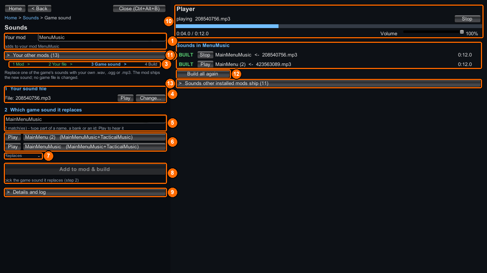

# Replace a shipped sound

Replace audio that Phoenix Point already plays. ContentTool bakes your file into a bank in your mod; the player needs no DLL.

## The quick way: the bench



1. Open the [bench](../bench/index.md) and choose `Sounds`. Type your mod’s name in `Your mod` (**1**).
2. Under `1  Your sound file` (**4**), pick your `.wav`, `.ogg` or `.mp3`. Press `Play` (**4**) to hear it.
3. Search for the game sound (**5**). Press `Play` beside a match (**6**) to hear it, then click its name to pick it. `Replaces` (**7**) confirms your pick.
4. Press `Add to mod & build` (**8**). The bench copies your file to `Content\Audio\Replace\<mediaId>.<ext>`, runs `ct_sound bake`, and loads the bank. Check the mark under `Sounds in <mod>` (**11**): `LIVE` means you can hear it now; otherwise restart the game.

[Sounds](../bench/sounds.md) explains the screen in full. The steps below are the console and manual way to make the same replacement.

## You need

- An installed, enabled ContentTool and a WAV, OGG or MP3 file with mono or stereo audio.
- The shipped **media ID** you want to replace. An event ID is a different number.

## Folder layout

```text
MySoundMod\
  meta.json
  ppcontent.json
  Content\
    Audio\
      Replace\
        sting_confirm.mp3      <- source file
  Dist\
    Sounds\
      633458426.bnk           <- written by ct_sound bake
      sources.ledger          <- source fingerprints; ships with the banks
```

## Steps

1. Find the media ID in the game console:

   ```text
   ct_list audio sting
   ```

   Look for a matching name and read the number in its first column. `loose` media can also be extracted; `in-bank` media can be listed but cannot be extracted.

2. To hear a loose original, extract its media ID:

   ```text
   ct_extract audio 633458426
   ```

   Look under `<persistentDataPath>\ContentTool\Extracted\audio` for its numeric `.wem` and decoded `.wav`. To search many sounds, run `ct_extract audio --all` or `ct_extract audio --all <filter>`. The bulk decode starts in the background, permits one run at a time, and writes `index.csv`. Its progress and final report appear in the log.

   To identify what a game action posts, start `ct_voices watch`, perform that action, and read the resulting event-to-media report. Use the **media** number for replacement.

3. Put `sting_confirm.mp3` directly in `Content\Audio\Replace`. Create `meta.json`:

   ```json
   {
     "ID": "example.mysoundmod",
     "AssemblyName": "",
     "Version": "1.0.0",
     "Name": [{ "Key": "English", "Value": "My sound mod" }],
     "Dependencies": ["com.morgott.ContentTool"]
   }
   ```

4. Create `ppcontent.json` with the media ID and exact source filename:

   ```json
   {
     "id": "example.mysoundmod",
     "bundle": "MySoundMod.bundle",
     "sounds": [
       { "media": 633458426, "file": "sting_confirm.mp3" }
     ]
   }
   ```

   A source named `<mediaId>.wav`, `<mediaId>.ogg` or `<mediaId>.mp3` needs no `sounds` row: its numeric stem supplies the ID.

5. Bake, then package from the game console:

   ```text
   ct_sound bake MySoundMod
   ct_package MySoundMod
   ```

   The bake writes one bank per accepted replacement into `Dist\Sounds`. It preserves the target loop region only when the shipped target is a loose `.wem`; an in-bank target gets no loop region.

## Check it worked

Look for these bake lines, then enable the packaged mod and trigger the original game sound:

```text
declared 1 replacement(s) in <project>\Content\Audio\Replace
baked <project>\Dist\Sounds\633458426.bnk: <bytes> B, bankId=<id>, media 633458426 = <ms>ms <ch>ch <rate>Hz, <loop report> from sting_confirm.mp3
ct_sound bake: 1/1 bank(s) in <project>\Dist\Sounds, 0 refused - NO game file was opened for writing. ContentTool loads these at init.
```

A successful package reports `PACKAGED <n> file(s), <bytes> B into <persistentDataPath>\ContentTool\Packaged\MySoundMod`. It also reports `LEFT BEHIND <n> source file(s)` for baked replacement sources. Those files remain in your author project; the release ships the banks and `sources.ledger`.

## Common errors

| What you see | Why | Fix |
|---|---|---|
| `ct_sound bake REFUSED: "sounds" names 'sting_confirm.mp3' for media 633458426, and there is no such file in <dir> - nothing was baked` | The row names a missing file. | Put that file in `Content\Audio\Replace` or correct `file`. |
| `bake REFUSED 633458426 is not one of the <count> media IDs Phoenix Point owns - nothing would ever play it` | The number is not a shipped media ID. | Find the media ID with `ct_list audio` or `ct_voices watch`. |
| `REFUSED: Content\Audio\Replace\<file> (media <id>) - a sound replacement that was NEVER BAKED.` | The release has a declared source but no bank. | Run `ct_sound bake MySoundMod`, then package again. |
| `REFUSED: Content\Audio\Replace\<file> (media <id>) - CHANGED SINCE IT WAS BAKED.` | Its bytes differ from the `sources.ledger` fingerprint. | Bake again, then package again. |
| `WARN: Content\Audio\Replace\<file> (media <id>) is newer than its bank in Dist\Sounds and no sources.ledger entry says which bytes that bank holds.` | Only file dates are available; the package is not refused on that evidence alone. | If you edited the source after baking, bake again. |

See [messages](../reference/messages.md) for more refusals.

## Example

[ReplaceUiSounds](https://github.com/UberMorgott/PhoenixPoint-Mod-ContentTool/tree/main/demos/ReplaceUiSounds) maps filenames to shipped media IDs. [MenuMusic](https://github.com/UberMorgott/PhoenixPoint-Mod-ContentTool/tree/main/demos/MenuMusic) uses numeric filenames.
