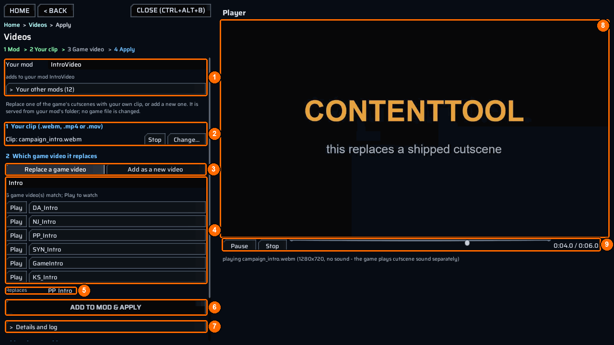

# Add or replace a video

Serve a WEBM, MP4 or MOV from your mod folder through the game’s live video catalog. A Replace row redirects a shipped clip; an Add row creates a new key that your behaviour must use.

## The quick way: the bench



1. Open the [bench](../bench/index.md) and choose `Videos`. Type your mod’s name in `Your mod` (**1**) and pick your `.webm`, `.mp4` or `.mov` clip (**2**).
2. Keep `Replace a game video` (**3**), search for the shipped clip, press `Play` to watch it, and click its name to pick it (**4**). `Replaces` (**5**) confirms your pick. For a new clip, choose `Add as a new video` (**3**) instead.
3. Press `Add to mod & apply` (**6**). The bench copies the clip into `Content\Videos`, writes the row below for you, and serves it with `ct_video live`. `Videos in <mod>`, further down the panel, shows `OK` for each clip that is in place; watch it in the player (**8**).

[Videos](../bench/videos.md) explains the screen in full. For Add, your mod’s code must still start the new key (step 5 below). The steps below are the console and manual way to make the same video row.

## You need

- One `.webm`, `.mp4` or `.mov` directly under `Content\Videos`.
- For Replace, a path from `ct_list videos`. For Add, a [behaviour DLL](behavior-dll.md) that starts the new clip.
- Separate sound or subtitle work if the cutscene needs it; a video row changes only the video file.

## Folder layout

```text
MyVideoMod\
  meta.json
  ppcontent.json
  Content\
    Videos\
      campaign_intro.webm    <- source stem is campaign_intro
```

## Steps

1. For Replace, find the shipped clip:

   ```text
   ct_list videos PP_Intro
   ```

   Copy the path printed for the clip. `asset` accepts that path relative to `StreamableCopiedAssets`, the full catalog path, or a unique filename. A whole-segment tail of the catalog path also matches; ambiguous tails are refused. To inspect a shipped clip, run `ct_extract video PP_Intro` and look under `<persistentDataPath>\ContentTool\Extracted\videos`.

2. Put one file named `campaign_intro.webm` directly in `Content\Videos`. Keep only one supported file per stem.

3. Create `meta.json`:

   ```json
   {
     "ID": "example.myvideomod",
     "AssemblyName": "",
     "Version": "1.0.0",
     "Name": [{ "Key": "English", "Value": "My video mod" }],
     "Dependencies": ["com.morgott.ContentTool"]
   }
   ```

   Set `AssemblyName` to your DLL filename if this mod needs its own trigger or def edit.

4. Create `ppcontent.json`. To **replace** the shipped clip, give the row an `asset`:

   ```json
   {
     "id": "example.myvideomod",
     "bundle": "MyVideoMod.bundle",
     "replace": [
       {
         "video": "campaign_intro",
         "asset": "StreamableCopiedAssets/Videos/Factions/Phoenix/PP_Intro.webm"
       }
     ]
   }
   ```

   To **add** a clip instead, use `{ "video": "campaign_intro" }` as the row and omit `asset`. The added RuntimeKey is stable: lower-case MD5 hex of `"<id>/<stem>"`, where `<stem>` is the clip's filename stem in lower case.

5. Validate, serve and inspect the row in the game console:

   ```text
   ct_project MyVideoMod
   ct_video live MyVideoMod
   ct_video status
   ```

   Enabling the packaged mod also serves its rows, Replace and Add alike. `ct_video live` refreshes it while you author. `ct_video status` reports how many content projects currently serve clips in memory. For Add, take the RuntimeKey from the live output and use it in the code that starts your clip.

6. Package after validation passes:

   ```text
   ct_package MyVideoMod
   ```

## Check it worked

A valid Replace row reports:

```text
video 'StreamableCopiedAssets/Videos/Factions/Phoenix/PP_Intro.webm' <- campaign_intro - serve it with: ct_video live MyVideoMod
ct_project: ALL PASS - nothing needed patching: none of this project's 1 replacement(s) names a shipped bundle, so no copy was written - the video row(s) above are served live by ct_video
```

An Add row reports `video ADD 'campaign_intro' (its RuntimeKey is printed by the command) - serve it with: ct_video live MyVideoMod`. The live output shows the key, its `before` and `after` paths, and a `registered` or `QUEUED` result. Play the relevant scene to check the clip itself.

Only one owner serves a RuntimeKey at a time. If two mods claim it, the lower ordinal mod ID serves it; the other clip is `QUEUED` and takes over if that owner lets go.

## Common errors

| What you see | Why | Fix |
|---|---|---|
| `VIDEO FAIL 'campaign_intro' is not a .webm/.mp4/.mov under Content\Videos\ - ct_video would skip this row` | The source stem has no supported clip in the folder. | Move or rename one clip, then run `ct_project` again. |
| `VIDEO FAIL '<asset>' <- campaign_intro: no catalog row names '<asset>' - ct_video would skip this row` | The Replace path matches no catalog row. | Copy a path from `ct_list videos`. |
| `VIDEO FAIL '<asset>' <- campaign_intro: '<asset>' is ambiguous, <n> rows match:` | More than one shipped row matches. | Use the full catalog path printed with the failure. |
| `SOURCE SKIPPED: Content\Videos\ holds two files with the same name: <files>` | Two extensions share one stem. | Keep one clip per stem and validate again. |
| `REFUSED: the "video" row '<stem>' names no .webm/.mp4/.mov under Content\Videos\` or `REFUSED: the "video" row '<stem>' is answered by <a> and <b>` | Packaging found a missing clip or same-stem pair. | Correct the folder and package again. |

See [messages](../reference/messages.md) for the remaining diagnostics.

## Example

[IntroVideo](https://github.com/UberMorgott/PhoenixPoint-Mod-ContentTool/tree/main/demos/IntroVideo) replaces a shipped catalog row. [QuitCutscene](https://github.com/UberMorgott/PhoenixPoint-Mod-ContentTool/tree/main/demos/QuitCutscene) adds a clip and supplies its trigger.
