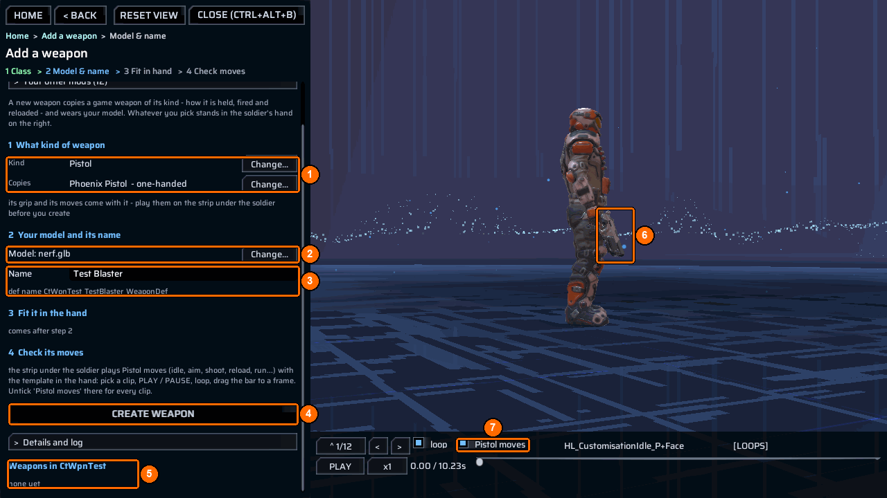

# Add a new weapon

Create a new `WeaponDef` beside a shipped weapon. The player can keep the original and obtain the new weapon as a separate inventory item.

## The quick way: the bench



1. Open the [bench](../bench/index.md) and choose `Add a weapon`. Type your mod’s name in `Your mod`, click a weapon kind, and check the shipped weapon it copies (**1**).
2. Pick your `.glb` (**2**), type a name (**3**), then press `Create weapon` (**4**). The bench copies the model and writes the `publish` and `weapons` rows shown below; no DLL is needed.
3. Press `Next: Build & share`, then `Build & test`. Enable the mod in `Mods` and restart the game.
4. Return to `Add a weapon`, click the weapon under `Weapons in <mod>` (**5**), press `Put it in the hand`, fit it with the sliders, and press `Save fit`. Check its moves on the strip under the soldier (**7**).

[Add a weapon](../bench/add-weapon.md) walks through every step with screenshots. The steps below are the manual way to make the same weapon, and the way to add a DLL of your own.

## You need

- ContentTool installed and enabled.
- A shipped `WeaponDef` of the same weapon class to clone.
- A fixed, unique GUID for each new weapon.
- Either no DLL at all (`"AssemblyName": ""`): ContentTool then builds the mod’s `weapons` rows when the mod is enabled. Or your own DLL, which must call `WeaponBuild.Build` itself; follow [Build a behaviour DLL](behavior-dll.md). The steps below use a DLL.
- For a new model, a GLB under `Content\Models`, a published key, and either `"fit": "auto"` or a declared `"shoot"` socket. `aim` and `shell` are optional.
- A new campaign if you use `count` and `clips` to seed starting storage.

## Folder layout

```text
MyAddedWeapon\
  meta.json
  ppcontent.json
  MyAddedWeapon.csproj
  src\
    MyAddedWeaponMain.cs          <- calls WeaponBuild.Build
  Content\
    Models\
      ar181.glb                   <- optional new prefab
  Dist\
    MyAddedWeapon.bundle          <- created by the bake
  bin\Release\MyAddedWeapon\
    MyAddedWeapon.dll             <- created by the DLL build
```

## Steps

1. Find an exact donor name in the game console:

   ```text
   ct_list defs SY_LaserAssaultRifle WeaponDef
   ```

   Choose a donor of the same class so its hold and fire actions suit your weapon.

2. Create `meta.json`:

   ```json
   {
     "ID": "example.myaddedweapon",
     "AssemblyName": "MyAddedWeapon.dll",
     "Version": "1.0.0",
     "Name": [{ "Key": "English", "Value": "My added weapon" }],
     "Dependencies": ["com.morgott.ContentTool"]
   }
   ```

3. Put `ar181.glb` directly under `Content\Models`. Create `ppcontent.json`:

   ```json
   {
     "id": "example.myaddedweapon",
     "bundle": "MyAddedWeapon.bundle",
     "publish": [
       {
         "key": "8f924c3a6d7e4b22a5f149b3cd882001",
         "asset": "models/ar181",
         "type": "GameObject",
         "deps": "defaultlocalgroup_unitybuiltinshaders.bundle"
       }
     ],
     "weapons": [
       {
         "id": "Example_AR_WeaponDef",
         "name": "Example AR",
         "clone": "SY_LaserAssaultRifle_WeaponDef",
         "guid": "8f924c3a-6d7e-4b22-a5f1-49b3cd882011",
         "model": "8f924c3a6d7e4b22a5f149b3cd882001",
         "fit": "auto",
         "damage": "45",
         "spread": "2.4",
         "count": "10",
         "clips": "10"
       }
     ]
   }
   ```

   Keep the `guid` stable across releases: it is the saved def identity. `weapons[].model` must equal `publish[].key`. A malformed weapon row refuses the whole `weapons` block.

4. Create the .NET project described in [Build a behaviour DLL](behavior-dll.md), with assembly name `MyAddedWeapon`. Put this in `src\MyAddedWeaponMain.cs`:

   ```csharp
   using Morgott.ContentTool.Tactical;
   using PhoenixPoint.Modding;

   namespace Example.MyAddedWeapon
   {
       public sealed class MyAddedWeaponMain : ModMain
       {
           public override bool CanSafelyDisable => true;

           public override void OnModEnabled()
           {
               WeaponBuild.Build(Instance.Entry.Directory, message => Logger.LogInfo(message));
           }
       }
   }
   ```

5. Build the DLL against your installed game, then confirm `bin\Release\MyAddedWeapon\MyAddedWeapon.dll` exists:

   ```text
   dotnet build MyAddedWeapon.csproj -c Release -p:PPRoot="<Phoenix Point>"
   ```

   Bake, verify the published key and package:

   ```text
   ct_project MyAddedWeapon
   ct_catalog apply MyAddedWeapon
   ct_catalog verify
   ct_package MyAddedWeapon
   ```

6. Enable the mod and start a **new** campaign. Equip the new weapon. If its model needs visual adjustment, load a geoscape campaign, open the bench with `ct_bench open`, and use [Fit a weapon](../bench/fit-weapon.md) (or `Add a weapon` with the weapon picked under `Weapons in <mod>`). Select the new weapon, adjust it and save, or inspect and save its fit in the console:

   ```text
   ct_fit Example_AR_WeaponDef
   ct_fit Example_AR_WeaponDef save
   ```

   A fit save writes the fitted values to this mod’s own `ppcontent.json`.

## Check it worked

The bake and catalog verification should include:

```text
ct_project: ALL PASS - <path>
ct_catalog: PASS - the game's own Addressables served the mod's own bundle, and nothing was written to the installation
ct_weapon PASS 'Example AR' (Example_AR_WeaponDef) cloned from SY_LaserAssaultRifle_WeaponDef; <report>
```

Check the new item, its model, firing and ammunition in game. `ct_weapon` is a **log prefix**, not a console command.

## Common errors

| What you see | Why | Fix |
|---|---|---|
| `ct_weapon FAIL System.IO.InvalidDataException:` | A required field, socket choice or GUID rule failed; the weapons block is refused. | Read the reported reason and correct the manifest before restarting. |
| `ct_weapon FAIL 'SY_LaserAssaultRifle_WeaponDef' is not in the def repository` | The donor name is wrong. | Copy an exact `WeaponDef` name from `ct_list defs`. |
| `[ContentTool] ct_weapon FAIL key` | The published model key did not load. | Match `model` and `publish[].key`, bake the bundle and inspect `ct_catalog status`. |
| `ct_fit: no weapon has been fitted this session.` | There is no fitted new weapon to adjust yet. | Enable the mod and give a soldier the new weapon first. |
| `ct_fit save REFUSED` | The bench could not update the declared weapon row. | Fix the manifest or path named by the refusal. |

See [messages](../reference/messages.md) for more diagnostics.

## Example

[WeaponAdd](https://github.com/UberMorgott/PhoenixPoint-Mod-ContentTool/tree/main/demos/WeaponAdd) declares three new weapons, published model keys and a DLL that calls the builder.
